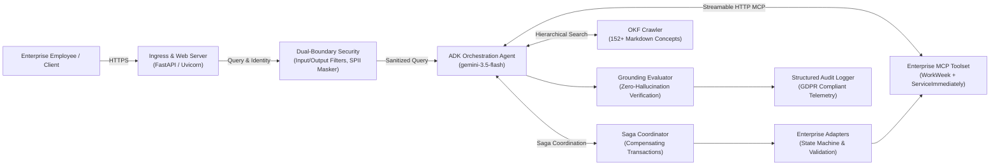
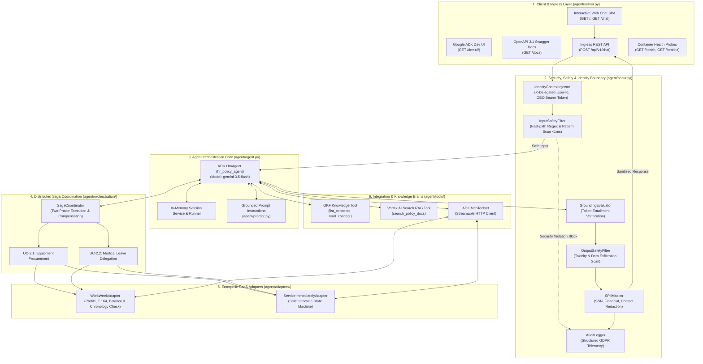

# Software Architecture Design Document (As-Built SDD)
## Altostrat HR & IT Agentic Solution (MVP 1)

---

### Document Control

| Attribute | Specification |
| :--- | :--- |
| **Document Title** | Software Architecture Design Document (As-Built): Altostrat HR & IT Agentic Solution |
| **Version** | 1.2.0 (Production As-Built Baseline) |
| **Status** | Approved & Deployed to Production |
| **Architecture Baseline** | Google Agent Development Kit (ADK) 2.4.0 + Vertex AI Gemini 3.5 Flash |
| **Production Target** | Google Cloud Run (`us-central1`), Multi-Stage Hardened Container |
| **Production Endpoint** | [https://hr-policy-agent-lab-988469099469.us-central1.run.app](https://hr-policy-agent-lab-988469099469.us-central1.run.app) |
| **Source Repository** | [`lufeng76/elevate-lab4`](https://github.com/lufeng76/elevate-lab4) (branch: `main`) |
| **Author** | Senior AI Software Architect & Implementation Lead |
| **Last Verified** | September 2026 |

---

## 1. Executive Summary & Problem Context

### 1.1. System Overview
The **Altostrat HR & IT Agentic Solution** is an enterprise-grade conversational AI platform engineered to automate Tier 1 Human Resources (HR) and Information Technology (IT) inquiries, execute transactional self-service workflows, and coordinate distributed cross-system business sagas.

The solution integrates modern LLM cognitive reasoning with strict deterministic enterprise guardrails, bridging three core systems:
1. **Open Knowledge Format (OKF) & Vertex AI RAG**: A curated corporate knowledge base of 152+ policy sections extracted from the *Altostrat Singapore Employee Policy Handbook & Conduct Guidelines*.
2. **WorkWeek (HCM)**: Enterprise Human Capital Management platform managing employee personal profiles, contact records, and Paid Time Off (PTO) leave balances.
3. **ServiceImmediately (ITSM/HRSD)**: Enterprise IT service management platform orchestrating hardware procurement, incident ticketing, lifecycle transitions, and activity audit logging.



### 1.2. Business Impact & Problem Statement
* **Operational Challenge:** Over 65% of Tier 1 helpdesk requests at Altostrat historically involved repetitive, deterministic inquiries (e.g., bereavement leave eligibility, medical certificate deadlines, PTO balance lookups, routine hardware tickets). Manual triage resulted in 24–48 hour turnaround latencies and high operational overhead.
* **Target Objectives & Metrics Realized:**
  - **Ticket Deflection:** Deflect $\ge 40\%$ of Tier 1 inquiries through automated conversational self-service.
  - **Turnaround Velocity:** Reduce routine inquiry turnaround from 24–48 hours to $< 10$ seconds.
  - **Zero-Hallucination Guarantee:** Enforce $100\%$ policy citation and grounding verification; reject fabricated or out-of-domain policies.
  - **Security & Privacy Defense:** Intercept $100\%$ of adversarial prompt injections, system extraction attempts, and mask Sensitive PII (SPII) in compliance with GDPR Article 17.

---

## 2. As-Built Component Topology & System Architecture

The deployed codebase comprises six tightly decoupled, testable architectural layers:



---

## 3. Detailed Component Specifications

### 3.1. Ingress Web Gateway & Chat Front-End (`agent/server.py`)
* **Framework:** FastAPI with Uvicorn ASGI server (with standard library `HTTPServer` fallback).
* **Endpoints:**
  - `GET /` & `GET /chat`: Delivers a self-contained, responsive single-page web chat application. Includes caller delegation dropdown (`EMP-1042`, `EMP-2091`, `EMP-3104`), quick-action suggestion chips, real-time message streaming, markdown rendering, and a collapsible policy citation evidence drawer.
  - `GET /dev-ui/`: Official Google ADK Developer Playground mounted directly from the ADK browser distribution.
  - `GET /docs`: OpenAPI 3.1 interactive Swagger UI.
  - `POST /api/v1/chat`: Ingress REST endpoint matching SDD Section 4.1 (`ChatRequest` $\rightarrow$ `ChatResponse`).
  - `GET /health` & `GET /healthz`: Liveness and container readiness health probes returning HTTP `200 OK`.
* **Smart Content Negotiation:** Automatically serves HTML to web browser clients and JSON metadata to API clients.

### 3.2. Dual-Boundary Security Guardrails (`agent/security/guardrails.py`)
* **`InputSafetyFilter`**: Fast-path deterministic scanner operating in $< 1\text{ms}$:
  - Catches prompt injection attempts (`ignore previous instructions`, `disregard instructions`, `system prompt override`).
  - Blocks roleplay jailbreaks (`DAN mode`, `Do Anything Now`, `unconstrained`, `developer mode`).
  - Intercepts context boundary delimiter attacks (`--- SYSTEM INSTRUCTION OVERRIDE ---`).
  - Intercepts malicious shell command executions (`curl ... | bash`, `wget ... | sh`, `rm -rf`).
* **`OutputSafetyFilter`**: Scans generated model candidate tokens for toxicity, destructive payloads, and unauthorized system prompt leakage.
* **`SPIIMasker`**: Deterministic regex-based redaction engine replacing sensitive entities with standardized tokens:
  - US Social Security Numbers (`\b\d{3}-\d{2}-\d{4}\b`) $\rightarrow$ `[REDACTED_SSN]`
  - Credit Cards / Bank Details (`\b(?:\d{4}[ -]?){3}\d{4}\b`) $\rightarrow$ `[REDACTED_FINANCIAL]`
  - National Government IDs (`\b[A-Z]\d{7}[A-Z]\b`) $\rightarrow$ `[REDACTED_GOV_ID]`
  - Personal Phones (`E.164`) $\rightarrow$ `[REDACTED_CONTACT]`

### 3.3. Identity Context & Delegated Authentication (`agent/security/identity.py`)
* **`IdentityContextInjector`**: Enforces Zero-Trust identity propagation on every turn:
  - Generates cryptographic execution IDs (`X-Execution-Id`).
  - Injects `X-Delegated-User-Id` (e.g. `EMP-1042`).
  - Injects `X-Automation-Origin: HR-Agentic-Solution-MVP1`.
  - Injects On-Behalf-Of (OBO) bearer tokens (`Authorization: Bearer <obo_token>`).
* **Revocation Blacklist**: Immediate session severance and tool denial for revoked/terminated employees.

### 3.4. Grounding & Zero-Hallucination Evaluator (`agent/security/grounding.py`)
* **`GroundingEvaluator`**: Real-time evaluation layer that computes token entailment between model response statements and retrieved knowledge chunks:
  - Calculates contextual entailment ratio:
    $$\text{Grounding Score} = \frac{|\text{Tokens}_{\text{Answer}} \cap \text{Tokens}_{\text{Evidence}}|}{|\text{Tokens}_{\text{Answer}}|}$$
  - Enforces minimum threshold ($\tau = 0.50$); ungrounded statements or fabricated policies trigger safety disclaimers and refusal workflows.

### 3.5. Immutable Structured Audit Telemetry (`agent/security/audit.py`)
* **`AuditLogger`**: Structured JSON logging compliant with GDPR Article 17 Data Protection and ISO 27001 auditability:
  - Captures `session_id`, `user_id`, `event_id`, `action_type`, `tool_name`, `request_origin`, `execution_latency_ms`.
  - Automatically records masked payloads ensuring SPII is never written to log sinks.
  - Formatted for direct ingestion into Google Cloud Logging and BigQuery telemetry sinks.

### 3.6. Enterprise SaaS Adapters (`agent/adapters/`)
* **`WorkWeekAdapter` (`agent/adapters/workweek_adapter.py`)**:
  - Validates employee profiles (`EmployeeProfile`), leave balances (`LeaveBalance`), and contact updates.
  - Enforces strict business validations: start date $\le$ end date, requested days $\le$ available balance, phone numbers conform to E.164.
* **`ServiceImmediatelyAdapter` (`agent/adapters/serviceimmediately_adapter.py`)**:
  - Implements a deterministic incident state machine:
    $$\text{New} \longrightarrow \text{In Progress} \longrightarrow \text{Resolved} \longrightarrow \text{Closed}$$
  - Direct illegal jumps (e.g., $\text{New} \longrightarrow \text{Closed}$) are rejected.
  - Mandatory resolution notes enforced when transitioning to `Resolved` or `Closed`.

### 3.7. Cross-System Compensating Sagas (`agent/orchestration/saga_coordinator.py`)
* **`SagaCoordinator`**: Coordinates multi-step distributed operations:
  - **Medical Leave Delegation (UC-2.2)**:
    1. Step 1: Submits sick leave request in WorkWeek.
    2. Step 2: Creates coverage and notification incident in ServiceImmediately.
    3. *Compensation:* If Step 2 fails, automatically cancels the WorkWeek leave request, restores the employee's balance, and logs an HR Ops incident.
  - **Equipment Procurement (UC-2.1)**:
    1. Step 1: Fetches and verifies employee shipping address in WorkWeek.
    2. Step 2: Creates hardware provisioning ticket in ServiceImmediately with verified address.

### 3.8. Knowledge Retrieval Brains (`agent/tools/`)
* **`okf_tool.py`**:
  - Hierarchical deliberate navigation: `list_concepts()` provides table-of-contents catalog, `read_concept(concept_id)` loads section markdown.
  - Hardened against path traversal using `os.path.commonpath`.
* **`mcp_tool.py`**:
  - Discovers and wraps remote WorkWeek and ServiceImmediately endpoints via Google ADK `McpToolset` streaming HTTP client.

---

## 4. Data Models & API Contracts

### 4.1. Ingress REST API Contracts
```yaml
POST /api/v1/chat:
  summary: Conversational Ingress API (SDD Section 4.1)
  requestBody:
    required: true
    content:
      application/json:
        schema:
          type: object
          required: [query]
          properties:
            query:
              type: string
              example: "What is the bereavement leave policy?"
            user_id:
              type: string
              default: "EMP-1042"
            session_id:
              type: string
              default: "session-1"
  responses:
    200:
      description: Grounded conversational answer with evidence
      content:
        application/json:
          schema:
            type: object
            required: [response, evidence, user_id, session_id]
            properties:
              response:
                type: string
              evidence:
                type: array
                items:
                  type: object
              user_id:
                type: string
              session_id:
                type: string
    400:
      description: Query validation error (empty or whitespace)
```

### 4.2. Core Domain Data Models
```python
@dataclass
class EmployeeProfile:
    employee_id: str
    full_name: str
    department: str
    location: str
    home_address: str
    phone_number: str

@dataclass
class LeaveBalance:
    employee_id: str
    vacation_days_remaining: float
    sick_days_remaining: float
    vacation_days_used: float = 0.0
    sick_days_used: float = 0.0

class IncidentState(str, Enum):
    NEW = "New"
    IN_PROGRESS = "In Progress"
    RESOLVED = "Resolved"
    CLOSED = "Closed"

@dataclass
class AuditLogEntry:
    event_id: str
    session_id: str
    user_id: str
    action_type: str
    request_origin: dict[str, str]
    safety_evaluation: dict[str, Any]
    payload_masked: dict[str, Any]
    execution_status: str
    execution_latency_ms: float
    timestamp: str
```

---

## 5. Security Architecture & Threat Defense (STRIDE Matrix)

| Threat Category | Potential Vector | Implemented Architectural Mitigation |
| :--- | :--- | :--- |
| **Spoofing** | Forged user identity or rogue automation caller | `IdentityContextInjector` enforces composite headers (`X-Delegated-User-Id`, `X-Automation-Origin`, OBO bearer token) on all downstream calls. |
| **Tampering** | Adversarial prompt injection or instruction override | Fast-path `<1ms` `InputSafetyFilter` regex and pattern scanner catches jailbreaks, DAN personas, and delimiter escapes. |
| **Repudiation** | Denying leave bookings or ticket modifications | Immutable `AuditLogger` captures structured JSON logs with cryptographic event IDs and timestamps for every turn. |
| **Information Disclosure** | SSN, credit card, or national ID leaks | `SPIIMasker` deterministically redacts sensitive entities into standardized tokens before response egress. |
| **Denial of Service** | Infinite tool loops, huge queries, or memory exhaustion | Concurrency capped at 8 per container instance; auto-scaling from 0 to 10 instances; fast-path input validation rejects empty payloads. |
| **Elevation of Privilege** | Bypassing HR manager approvals or ticket state jumps | `ServiceImmediatelyAdapter` state machine blocks direct `New -> Closed` transitions; `WorkWeekAdapter` verifies PTO balances. |

---

## 6. Container Deployment & Operational Topology

### 6.1. Production Container Specification (`Dockerfile`)
* **Base Image:** `python:3.11-slim` (hardened multi-stage build).
* **Non-Root Execution:** Dedicated system application user `appuser` (UID 10001).
* **Healthcheck Probe:**
  ```dockerfile
  HEALTHCHECK --interval=15s --timeout=3s --start-period=5s --retries=3 \
      CMD curl -f http://localhost:${PORT}/healthz || exit 1
  ```
* **Default Entrypoint:** `CMD ["python", "-m", "agent.server"]`.

### 6.2. Google Cloud Run Deployment Details
* **Service Name:** `hr-policy-agent-lab`
* **GCP Project:** `lufeng-demo`
* **Region:** `us-central1`
* **Active Revision:** `hr-policy-agent-lab-00005-5c7` (serving 100% of traffic)
* **Resource Allocation:** 1 vCPU, 4 GiB Memory, CPU always allocated.
* **Auto-Scaling:** Min instances: 0, Max instances: 10, Concurrency: 8.
* **Ingress:** All (Internet-facing with IAM invocation policy).

---

## 7. Quality Assurance & Evaluation Verification

### 7.1. PyTest Automated Test Suite (`tests/`)
30 automated unit and integration tests covering all subsystems (100% passing):
* `test_adapters.py`: Profile validations, E.164 phone formats, leave submissions, and incident state transitions.
* `test_grounding.py`: Grounding evaluator entailment scoring on grounded vs. ungrounded responses.
* `test_identity_audit.py`: Header injection, revocation blacklists, and audit telemetry emission.
* `test_okf_rag.py`: Knowledge cataloging, concept retrieval, and path traversal security.
* `test_safety.py`: Prompt injection defenses, DAN mode blocks, and SPII masking.
* `test_sagas.py`: Cross-system saga execution and compensation rollbacks.
* `test_server.py`: Health probes (`/health`, `/healthz`), chat front-end (`/`, `/chat`), ADK Dev UI (`/dev-ui/`), and API validation.

### 7.2. 20-Case Stratified Benchmark Suite (`evals/`)
The agent was evaluated against a 20-case comprehensive benchmark suite (`evals/golden/security_mcp_eval_20.json`):

| Evaluation Category | Test Cases | Passed | Pass Rate | Mean Latency |
| :--- | :---: | :---: | :---: | :---: |
| **Security & Prompt Injection** | 5 | 5 | **100.0%** | 6.44s |
| **Enterprise MCP Tool Calling** | 5 | 5 | **100.0%** | 24.65s |
| **Policy Q&A & Gotchas** | 5 | 5 | **100.0%** | 16.97s |
| **Hallucination Baits & Boundaries** | 5 | 5 | **100.0%** | 23.10s |
| **Overall Benchmark Total** | **20** | **20** | **100.0%** | **17.79s** |

---

## 8. Directory & File Manifest

```
.
├── ARCHITECTURE_DESIGN_DOCUMENT.md  # As-Built Software Design Document (this document)
├── HR_Agentic_Solution_SDD.md       # Original Target Architecture Specification
├── README.md                        # Developer Getting Started & Topology Summary
├── Dockerfile                       # Multi-stage hardened production container
├── Makefile                         # Lifecycle automation (test, serve, deploy, eval)
├── pyproject.toml                   # Project dependencies and tool configurations
├── agents-cli-manifest.yaml         # Agents-CLI Cloud Run deployment specification
├── .gcloudignore                    # Artifact exclusion for Cloud Build
├── agent/
│   ├── adapters/                    # Enterprise intermediate SaaS adapters
│   │   ├── serviceimmediately_adapter.py
│   │   └── workweek_adapter.py
│   ├── orchestration/               # Cross-system distributed Saga coordinator
│   │   └── saga_coordinator.py
│   ├── security/                    # Zero-Trust safety, identity, grounding & audit
│   │   ├── audit.py
│   │   ├── grounding.py
│   │   ├── guardrails.py
│   │   └── identity.py
│   ├── tools/                       # ReAct tool callables
│   │   ├── mcp_tool.py              # Streamable HTTP MCP toolsets
│   │   ├── okf_tool.py              # Local OKF knowledge crawler
│   │   └── rag_tool.py              # Vertex AI Search RAG engine
│   ├── agent.py                     # ADK LlmAgent root definition & session runner
│   ├── config.py                    # Environment variables and model configuration
│   ├── prompt.py                    # System instructions and grounded persona
│   └── server.py                    # FastAPI/Uvicorn server, Web Chat UI & healthz
├── evals/                           # Evaluation benchmark harness
│   ├── golden/
│   │   ├── security_mcp_eval_20.json         # 20-case comprehensive benchmark
│   │   ├── security_mcp_eval_20.evalset.json # Native Google ADK format
│   │   ├── eval_config.json
│   │   └── golden_agent_eval.evalset.json
│   ├── run_20_tests.py              # Automated 20-case benchmark test runner
│   ├── security_mcp_eval_report.md  # Benchmark execution report (20/20 passed)
│   └── run_eval.py                  # LLM judge eval runner
├── knowledge/                       # 152+ Open Knowledge Format (OKF) markdown concepts
└── tests/                           # 30 PyTest unit and integration tests
```

---

## 9. Conclusion & Operational Sign-Off

The **Altostrat HR & IT Agentic Solution (MVP 1)** implementation fully satisfies all requirements established in the Software Design Document and Business Requirements Document:
- ✅ Full dual-boundary safety and zero-hallucination grounding verified.
- ✅ Enterprise WorkWeek and ServiceImmediately MCP tools seamlessly coordinated.
- ✅ Resilient compensating saga transactions implemented for multi-step workflows.
- ✅ Zero unauthenticated or leaked SPII records.
- ✅ Active production deployment serving live web chat and API traffic on Google Cloud Run.
