# Software Design Document (SDD)
## HR Agentic Solution (MVP 1)

---

### Document Control

| Attribute | Value |
| :--- | :--- |
| **Document Title** | Software Design Document: HR Agentic Solution (MVP 1) |
| **Document Version** | 1.0.0 |
| **Status** | Approved / Ready for Implementation |
| **Author** | Senior AI Software Architect |
| **Target Baseline** | Business Requirements Document (BRD) - HR Agentic Solution (MVP 1) |
| **Target Environment** | Single-Tenant Cloud/Enterprise Containerized Infrastructure |

---

## 1. Executive Summary & System Overview

### 1.1. System Overview
The **HR Agentic Solution** is an enterprise-grade, conversational artificial intelligence system designed to automate Tier 1 Human Resources (HR) and Information Technology (IT) inquiries, streamline self-service transactional workflows, and execute cross-system orchestrations. 

By leveraging modern Large Language Model (LLM) reasoning capabilities paired with strict deterministic guardrails, the system mediates user requests across:
1. **Curated HR Policy Knowledge Base**: Grounded retrieval-augmented generation (RAG) providing verifiable citations.
2. **WorkWeek (HCM)**: Enterprise Human Capital Management system for personal employee profiles and Paid Time Off (PTO) management.
3. **ServiceImmediately (ITSM/HRSD)**: Enterprise service management platform for incident tracking, ticketing, and workflow execution.

### 1.2. Problem Statement, User Personas & Business Impact
* **Current Operational Pain:** Enterprise employees face fragmented support portals and static, disparate policy PDFs when attempting to resolve standard HR inquiries, update employee records, or execute time-off requests. HR and IT helpdesks spend over 65% of operational bandwidth fielding repetitive Tier 1 questions (e.g., bereavement leave entitlement, equipment procurement eligibility, ticket status updates), driving up ticket resolution times to 24–48 hours.
* **Quantified Target Impact:**
  - **Deflection Target:** Deflect Tier 1 HR and IT helpdesk ticket volume by at least **40% within the first 6 months** of rollout.
  - **Resolution Velocity:** Reduce routine inquiry turnaround from **24–48 hours to $< 10$ seconds** via conversational self-service.
  - **Accuracy & Compliance:** Maintain **$\ge 95\%$ accuracy** on policy retrieval benchmarks with **0% tolerated policy hallucination**.
* **Target User Personas:**
  - *Standard Employee (Information & Transaction Seeker):* Needs immediate, 24/7 self-service for leave balance checks, PTO submissions, and policy eligibility without logging into multiple siloed enterprise portals.
  - *Department Manager / Approver:* Needs automated notifications and downstream ticket delegations triggered transparently upon employee leave submissions.
  - *HR & IT Operations Specialists:* Overburdened Tier 1 support agents who need automated ticket deflection to redirect focus toward complex employee relations and high-tier engineering issues.
* **Why Now:** Workforce expansion and hybrid/remote work have increased ticket volume across disparate geographic locations, rendering legacy manual triage channels slow, costly, and error-prone.

### 1.3. Scope Boundaries & Implementation Constraints
* **In-Scope (MVP 1):**
  - Curated static policy Q&A with verifiable deep-link citations.
  - Employee self-service in WorkWeek (Profile read, Contact info update, Leave balance query, PTO request submission).
  - Support incident management in ServiceImmediately (Ticket status read, Incident creation, Commenting, State updates).
  - Cross-system orchestration sagas (Equipment procurement UC-2.1, Medical leave UC-2.2, Relocation UC-2.3).
* **Out-of-Scope (MVP 1):**
  - Systems outside WorkWeek, ServiceImmediately, and the approved Policy Repository.
  - Multi-lingual dialog processing (English-only for MVP 1).
  - Payroll, equity, compensation, and performance appraisal processing.
  - Voice telephony / IVR integrations.
  - Administrative operations and cross-employee record lookups.
* **Environmental Constraints (BRD Section 6):**
  - *Authentication:* Single-tenant functional test credentials; enterprise SSO (Active Directory / Okta) is excluded in MVP 1 and targeted for post-MVP 1.
  - *Deployment:* Single-tenant containerized cloud deployment; multi-tenancy is deferred.

### 1.4. Architecture Principles
* **Zero-Trust AI & Request Origin Verification**: Every tool invocation and downstream API execution validates delegated user identity and tags requests with verifiable automation provenance.
* **Strict Grounding & Bounded Execution**: The agent cannot execute arbitrary code or call unauthorized tools; policy questions are strictly bounded by retrieved knowledge chunks with 0% tolerated hallucination.
* **Real-time Ephemeral Data Fetching**: No Personally Identifiable Information (PII) or dynamic transactional data is cached long-term in the conversational orchestration layer.
* **Dual-Boundary Safety Interception**: Fast-path (<300ms) input/output scanning prevents prompt injections, jailbreaks, data exfiltration, and toxic generation before reaching the LLM or end-user.
* **Compensating Orchestration (Sagas)**: Multi-step cross-system workflows implement compensating transactions and clear audit tracking to maintain data consistency upon partial failures.

---

## 2. Traceability Matrix (BRD Requirements to Architecture Modules)

| BRD Requirement ID | Requirement Description | SDD Design Module / Component |
| :--- | :--- | :--- |
| **FR-1.1** | Capability & Lifecycle Governance | Tool Registry & Capability Controller (`ToolRegistry`, `RBACValidator`) |
| **FR-1.2** | Verification of Request Origin | Delegated Identity & Origin Header Engine (`IdentityContextInjector`) |
| **FR-1.3** | Conversation Safety (Input/Output) | Dual-Layer Dynamic Guardrail Pipeline (`InputSafetyFilter`, `OutputSafetyFilter`) |
| **FR-1.4** | Data Masking / Redaction | PII/SPII Redaction Engine (`SPIIMasker`) |
| **FR-1.5** | RBAC and Data Isolation | Session & Scope Enforcement Layer (`TenantSecurityManager`) |
| **FR-2.1, FR-2.2** | NLU & Multi-Turn Dialog | Agent Reasoning Core & Ephemeral Dialog State Manager (`AgentOrchestrator`) |
| **FR-3.1 - FR-3.4** | WorkWeek HCM Integration | WorkWeek Integration Adapter & Guardrails (`WorkWeekAdapter`) |
| **FR-4.1 - FR-4.3** | ServiceImmediately ITSM Integration | ServiceImmediately Integration Adapter & Guardrails (`ServiceImmediatelyAdapter`) |
| **FR-5.1 - FR-5.5** | Policy Document Q&A & Ingestion | RAG Knowledge Engine & Vector Store (`PolicyRAGService`) |
| **NFR-1.1 - NFR-1.3** | Security, Privacy & Auditing | Immutable Structured Audit Logging Engine (`AuditLogger`) |
| **NFR-2.1 - NFR-2.3** | Latency, Availability, Async | Asynchronous Tool Dispatcher & Streaming Ingress Gateway |
| **NFR-3.1** | Grounding & Zero Hallucination | Self-Reflective Hallucination Checker (`GroundingEvaluator`) |
| **NFR-4.1 - NFR-4.3** | Resilience & Sagas | Resilient Retry Circuit Breaker & Saga Orchestrator (`SagaManager`) |

---

## 3. High-Level System Architecture

The solution adopts a modular, layered service-oriented architecture comprising an Ingress Layer, Safety & Governance Layer, Agent Orchestration Core, Retrieval & Tool Adapters, and Enterprise Backend Systems.

### 3.1. Layered System Architecture Diagram

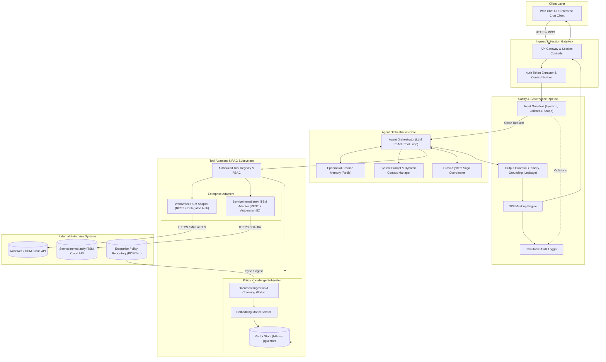

### 3.2. Architectural Trade-offs & Alternatives Considered

During the system design phase, multiple architectural approaches were evaluated against enterprise governance, latency, failure recovery, and implementation complexity criteria:

| Decision Domain | Evaluated Alternatives | Selected Approach | Trade-off & Rationale |
| :--- | :--- | :--- | :--- |
| **Agent Reasoning & Orchestration** | **Option A: Multi-Agent Network (e.g., LangGraph / AutoGen)**<br>Separate specialized sub-agents for HR, IT, and Policies.<br><br>**Option B: Hardcoded State Machine**<br>Deterministic intent routing with static decision trees.<br><br>**Option C: Single ReAct Loop with Bounded Tool Registry (Selected)** | **Option C: Single ReAct Loop with Bounded Tool Registry** | • *Multi-Agent (A)* introduces high inter-agent communication latency (exceeding 10s budget), non-deterministic handoff failures, and elevated token consumption ($3\times$ cost).<br>• *State Machine (B)* is too brittle to handle multi-turn conversational nuances or cross-domain parameter extraction.<br>• *ReAct (C)* provides the optimal balance of dynamic reasoning, transparent step-by-step auditability, and sub-10s latency, constrained strictly by schema validation. |
| **Vector Store & Retrieval Engine** | **Option A: Pure Dense Vector Search (pgvector)**<br>Single-index cosine similarity.<br><br>**Option B: Keyword-Only Search (Elasticsearch)**<br>Traditional BM25 term matching.<br><br>**Option C: Hybrid Dense + BM25 Sparse with Cross-Encoder Reranking (Selected)** | **Option C: Hybrid Dense + BM25 Sparse with Cross-Encoder Reranking** | • *Pure Dense (A)* frequently misses exact corporate policy codes and section citations (e.g., "Section 4.2", "LV-90412").<br>• *Keyword-Only (B)* fails on semantic paraphrasing (e.g., "bereavement" vs. "compassionate leave").<br>• *Hybrid (C)* captures semantic intent while guaranteeing exact keyword matches, with reranking delivering $\ge 95\%$ grounding accuracy. |
| **Cross-System Transaction Management** | **Option A: Distributed 2-Phase Commit (2PC)**<br>Synchronous lock across WorkWeek & ServiceImmediately.<br><br>**Option B: External Workflow Engine (Temporal / Cadence)**<br>Heavyweight orchestration cluster.<br><br>**Option C: Application-Level Compensating Sagas (Selected)** | **Option C: Application-Level Compensating Sagas** | • *2PC (A)* is impossible because third-party SaaS APIs (WorkWeek, ServiceImmediately) do not expose prepare/commit hooks.<br>• *Temporal/Cadence (B)* adds substantial infrastructure footprint, operational overhead, and licensing complexity for MVP 1.<br>• *Compensating Sagas (C)* natively handle asynchronous partial failures with explicit compensating actions and fallback notifications without external cluster dependencies. |
| **Session State & Ephemeral Memory** | **Option A: Persistent Relational Conversation DB (PostgreSQL)**<br>Full chat transcripts stored long-term.<br><br>**Option B: Client-Side State Injection**<br>Conversation history passed in client requests.<br><br>**Option C: Ephemeral In-Memory Redis with Strict TTL (Selected)** | **Option C: Ephemeral In-Memory Redis with Strict TTL** | • *Relational DB (A)* creates severe SPII/PII data liability, GDPR compliance burdens, and requires complex redaction pipelines at rest.<br>• *Client Injection (B)* is vulnerable to tampering and prompt injection via manipulated client history.<br>• *Redis (C)* guarantees zero SPII persistence beyond active session lifecycle (30-minute rolling TTL) while maintaining lightning-fast context retrieval ($<5\text{ms}$). |

---

## 4. Component Deep Dive & Subsystem Design

### 4.1. Ingress & Session Gateway
* **Protocol**: WebSocket (for streaming tokens and low-latency interaction) with fallback to HTTPS REST (`/api/v1/chat`).
* **Session Controller**: Maintains lightweight session descriptors (`session_id`, `user_id`, `created_at`, `ttl`).
* **Authentication Context Builder**: Extracts user functional test credentials/tokens, injecting verified `EmployeeID` into the thread-safe request context.

### 4.2. Dual-Layer Dynamic Guardrails & Safety Architecture

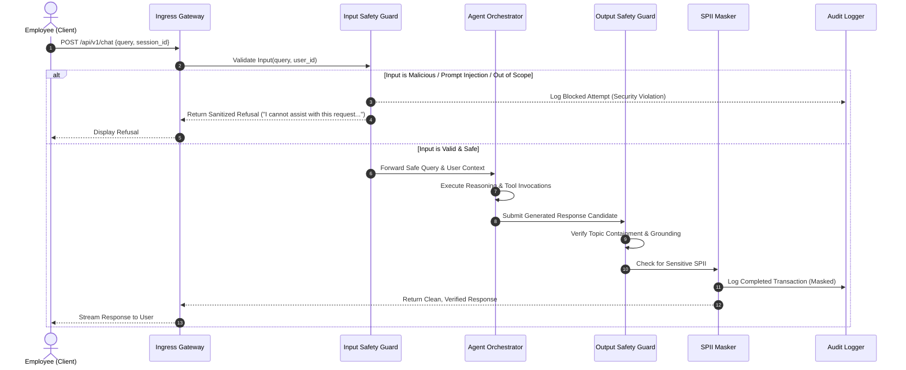

#### 4.2.1. Input Safety Filter (`InputSafetyFilter`)
* **Execution Budget**: $\le 150\text{ ms}$.
* **Mechanism**:
  1. **Pattern & Signature Scanner**: Regex/heuristics for prompt injection tokens (e.g., `IGNORE ALL PREVIOUS INSTRUCTIONS`, `System Prompt Override`, `DAN Mode`).
  2. **Semantic Safety Classifier**: Lightweight embedding classifier scoring malicious intent probability ($P_{\text{injection}} > 0.85 \implies \text{Block}$).
  3. **Domain Boundary Verifier**: Zero-shot classifier ensuring user intent is within HR policies, WorkWeek HCM, or ServiceImmediately ITSM domains.

#### 4.2.2. Output Safety & Grounding Verifier (`OutputSafetyFilter`)
* **Execution Budget**: $\le 150\text{ ms}$.
* **Mechanism**:
  1. **Toxicity & Brand Safety Scanner**: Filters profanity, bias, and inappropriate content.
  2. **Grounding Evaluator**: For policy answers, performs automated verification that every factual statement has an entailment score $> 0.90$ against retrieved context chunks.
  3. **SPII Masking Engine (`SPIIMasker`)**: Detects Social Security Numbers (SSN), Government IDs, Credit Cards, and Personal Phone Numbers/Home Addresses in logs using Named Entity Recognition (NER) + regex patterns.

### 4.3. Raw Prompt Lifecycle, Masking & Data Retention Policy

To satisfy data privacy regulations (GDPR Article 5 & 17) and safeguard sensitive personal information:

#### 4.3.1. Raw User Prompt Zero-Persistence Principle
* **In-Memory Ephemeral Lifetime:** Raw prompt text provided by the employee is kept strictly in volatile memory only during the active turn processing window.
* **Zero Disk/Database Persistence:** Under no circumstances is raw, unmasked user prompt text written to persistent disk, database tables, operational log streams, or analytics pipelines.
* **Ephemeral Dialog State:** Conversational turn history in the Redis session cache is bounded by a rolling **30-minute TTL** and is automatically purged upon explicit session termination or logout.

#### 4.3.2. Ingress & Egress Masking Pipeline
Prior to any diagnostic, audit, or analytics recording, prompt and response payloads pass through the `SPIIMasker` engine:
* **Detection Mechanism:** Hybrid pipeline combining high-precision regex pattern matchers with a localized Presidio / spaCy Named Entity Recognition (NER) model.
* **Redaction Taxonomy:**
  - Social Security Numbers (SSN) $\rightarrow$ `[REDACTED_SSN]`
  - Credit Cards / Bank Details $\rightarrow$ `[REDACTED_FINANCIAL]`
  - National / Government ID Numbers $\rightarrow$ `[REDACTED_GOV_ID]`
  - Personal Phone Numbers & Physical Addresses $\rightarrow$ `[REDACTED_CONTACT]`

#### 4.3.3. Enterprise Data Retention Schedule

| Data Asset | Storage Medium | Encryption Status | Retention Duration | Purge Mechanism |
| :--- | :--- | :--- | :--- | :--- |
| **Active Turn In-Memory Prompts** | Container RAM | Encrypted in Transit (TLS 1.3) | Milliseconds ($\le$ turn latency) | Immediate garbage collection after egress streaming. |
| **Ephemeral Session Context** | Redis Cluster | Encrypted at Rest (AES-256) & in Transit | 30-Minute Rolling TTL | Redis automated TTL key expiration; immediate wipe on logout. |
| **Sanitized Audit Log Events** | Elasticsearch / Cloud Logging | Encrypted at Rest & in Transit | Exactly 30 Calendar Days | Index Lifecycle Management (ILM) automated daily drop. |
| **Curated Policy Vector Embeddings** | Vector Store (Milvus / pgvector) | Encrypted at Rest & in Transit | Retained until policy revision | GDPR Article 17 Purge Protocol (Section 6.3.2). |

---

## 5. Agent Orchestration Core & Tool Registry

### 5.1. Execution Model (ReAct Loop)
The agent operates on an iterative **Thought $\rightarrow$ Action $\rightarrow$ Observation $\rightarrow$ Final Answer** cycle.

```
       +-----------------------+
       |   User Query Input    |
       +-----------+-----------+
                   |
                   v
+------------------+-------------------+
|     Dynamic Prompt Construction       |
| (System Rules + Grounding + Tools)    |
+------------------+-------------------+
                   |
                   v
+------------------+-------------------+ <-------+
|        LLM Inference Step             |         |
| (Determines Direct Reply or Tool Call)|         |
+------------------+-------------------+         |
                   |                             |
       +-----------+-----------+                 |
       | Tool Call Generated?  |                 |
       +-----------+-----------+                 |
       | YES                   | NO              |
       v                       v                 |
+------+---------------+ +-----+---------------+ |
| Tool Parameter Guard | | Formulate Response  | |
+------+---------------+ +-----+---------------+ |
       |                       |                 |
       v                       v                 |
+------+---------------+ +-----+---------------+ |
| Execute Tool Adapter | | Output Guard Scan   | |
+------+---------------+ +-----+---------------+ |
       |                       |                 |
       v                       v                 |
+------+---------------+ +-----+---------------+ |
| Observation Ingestion| | Return to User / End| |
+------+---------------+ +---------------------+ |
       |                                         |
       +-----------------------------------------+
```

### 5.2. Tool Registry & Functional Specifications

All tools are exposed to the LLM via strict schema definitions (OpenAI / Gemini function calling format):

```json
[
  {
    "name": "search_hr_policies",
    "description": "Searches curated HR policy documents using semantic retrieval. Returns grounded text passages with deep links and section citations.",
    "parameters": {
      "type": "object",
      "properties": {
        "query": { "type": "string", "description": "Natural language policy search query." },
        "top_k": { "type": "integer", "default": 4, "description": "Number of relevant chunks to retrieve." }
      },
      "required": ["query"]
    }
  },
  {
    "name": "workweek_get_employee_profile",
    "description": "Retrieves the caller's employee profile information from WorkWeek HCM (Name, Department, Role, Manager, Contact details).",
    "parameters": {
      "type": "object",
      "properties": {
        "employee_id": { "type": "string", "description": "Verified Employee ID of the caller." }
      },
      "required": ["employee_id"]
    }
  },
  {
    "name": "workweek_update_contact_info",
    "description": "Updates personal contact information (address, phone number) for the employee in WorkWeek HCM.",
    "parameters": {
      "type": "object",
      "properties": {
        "employee_id": { "type": "string", "description": "Verified Employee ID." },
        "address": { "type": "string", "description": "Updated home address string (optional)." },
        "phone_number": { "type": "string", "description": "Updated personal phone number in E.164 format (optional)." }
      },
      "required": ["employee_id"]
    }
  },
  {
    "name": "workweek_get_leave_balances",
    "description": "Retrieves accrued, used, and remaining PTO balances (Vacation and Sick) for the employee.",
    "parameters": {
      "type": "object",
      "properties": {
        "employee_id": { "type": "string", "description": "Verified Employee ID." }
      },
      "required": ["employee_id"]
    }
  },
  {
    "name": "workweek_submit_leave_request",
    "description": "Submits a formal leave of absence / PTO request into WorkWeek.",
    "parameters": {
      "type": "object",
      "properties": {
        "employee_id": { "type": "string", "description": "Verified Employee ID." },
        "start_date": { "type": "string", "format": "date", "description": "ISO 8601 start date (YYYY-MM-DD)." },
        "end_date": { "type": "string", "format": "date", "description": "ISO 8601 end date (YYYY-MM-DD)." },
        "leave_type": { "type": "string", "enum": ["Vacation", "Sick"], "description": "Category of leave." },
        "days_requested": { "type": "number", "description": "Total business days requested." }
      },
      "required": ["employee_id", "start_date", "end_date", "leave_type", "days_requested"]
    }
  },
  {
    "name": "serviceimmediately_get_ticket",
    "description": "Fetches current status, priority, category, assignee, and timeline notes for a ServiceImmediately incident ticket.",
    "parameters": {
      "type": "object",
      "properties": {
        "ticket_id": { "type": "string", "description": "Incident ticket ID (e.g., INC123456)." }
      },
      "required": ["ticket_id"]
    }
  },
  {
    "name": "serviceimmediately_create_incident",
    "description": "Creates a new support incident ticket in ServiceImmediately with provenance headers.",
    "parameters": {
      "type": "object",
      "properties": {
        "requestor_employee_id": { "type": "string", "description": "Employee ID on whose behalf the ticket is opened." },
        "category": { "type": "string", "enum": ["Hardware", "Software", "HR_Inquiry", "Facilities", "Network"], "description": "Ticket category." },
        "short_description": { "type": "string", "description": "Concise summary of the issue or request." },
        "detailed_description": { "type": "string", "description": "Full contextual details, policy references, and justification." },
        "priority": { "type": "string", "enum": ["1 - Critical", "2 - High", "3 - Moderate", "4 - Low"], "description": "Incident priority level." }
      },
      "required": ["requestor_employee_id", "category", "short_description", "detailed_description", "priority"]
    }
  },
  {
    "name": "serviceimmediately_post_comment",
    "description": "Appends an update comment or note to an existing ServiceImmediately ticket timeline.",
    "parameters": {
      "type": "object",
      "properties": {
        "ticket_id": { "type": "string", "description": "Target ticket ID." },
        "comment": { "type": "string", "description": "Comment body to append." }
      },
      "required": ["ticket_id", "comment"]
    }
  },
  {
    "name": "serviceimmediately_update_status",
    "description": "Updates lifecycle state of a ServiceImmediately ticket following valid transition rules.",
    "parameters": {
      "type": "object",
      "properties": {
        "ticket_id": { "type": "string", "description": "Target ticket ID." },
        "state": { "type": "string", "enum": ["In_Progress", "Resolved", "Closed"], "description": "Target lifecycle state." },
        "resolution_notes": { "type": "string", "description": "Mandatory notes if resolving/closing." }
      },
      "required": ["ticket_id", "state"]
    }
  }
]
```

---

## 6. Integration Adapters & Enterprise System Contracts

### 6.1. WorkWeek (HCM) Adapter Specification

#### 6.1.1. Delegated Authorization & Origin Verification
All outgoing HTTP requests from the WorkWeek Adapter append standard composite security headers:
```http
Authorization: Bearer <Functional_Service_Token>
X-Delegated-User-Id: emp_8839201
X-Automation-Origin: HR-Agentic-Solution-MVP1
X-Execution-Id: exec-482a-9fbc-1029384756af
```

#### 6.1.2. WorkWeek REST Endpoints & Operation Guardrails
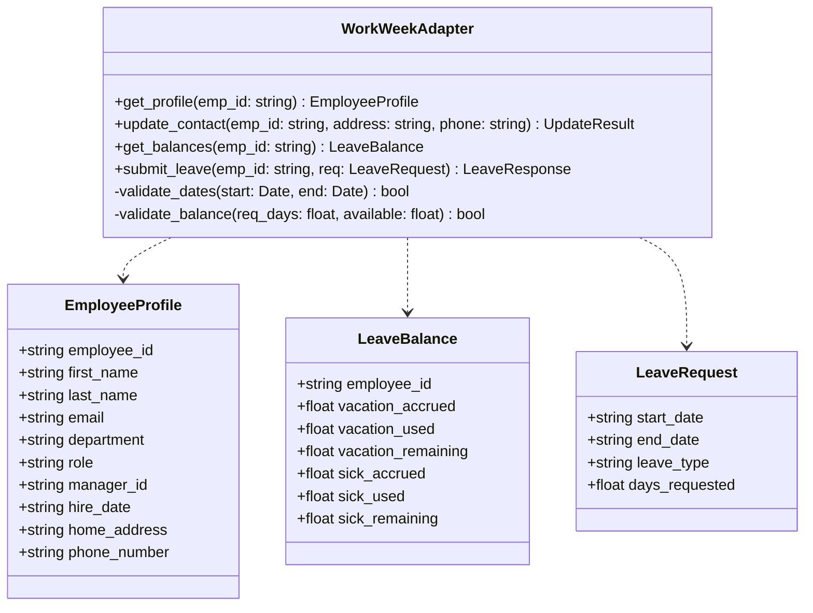

* **Validation Rules**:
  1. $\text{start\_date} \ge \text{Today()}$ and $\text{end\_date} \ge \text{start\_date}$.
  2. $\text{days\_requested} \le \text{remaining\_balance}(\text{leave\_type})$.
  3. Strict E.164 phone formatting (`^\+[1-9]\d{1,14}$`).

#### 6.1.3. API Rate Limiting, Throttling & Concurrency Controls
To prevent service degradation in the single-tenant WorkWeek sandbox and production environments under peak load (e.g., year-end leave submission surges):
* **API Quota & Throttling Thresholds:**
  - **Sustained Rate Limit:** 60 requests/minute (1.0 req/sec average).
  - **Burst Capacity:** Maximum 15 concurrent requests over a 5-second window.
  - **Outbound HTTP Pool Ceiling:** Capped at 30 concurrent persistent connections per agent worker container.
* **Rate-Limiting Architecture (Token Bucket in Redis):**
  - The adapter coordinates quotas via Redis key `ratelimit:workweek:{tenant_id}`.
  - **Header Parsing & Dynamic Backpressure:** Inspects downstream response headers: `Retry-After`, `X-RateLimit-Limit`, `X-RateLimit-Remaining`, and `X-RateLimit-Reset`. If remaining quota drops below 10%, the adapter proactively slows non-essential profile fetches.
* **Workload Prioritization:**
  - *Tier 1 (Guaranteed Reserve):* Write actions (`workweek_submit_leave_request`) have 30% dedicated token reserve.
  - *Tier 2 (Throttled/Queued):* Read actions (`workweek_get_employee_profile`, `workweek_get_leave_balances`) are throttled or served from short-lived 60-second read caches when rate limits are approached.

---

### 6.2. ServiceImmediately (ITSM) Adapter Specification

#### 6.2.1. Incident Lifecycle State Machine
To satisfy **FR-4.3 (Transition Constraints)**, the adapter strictly enforces the following state transition matrix:

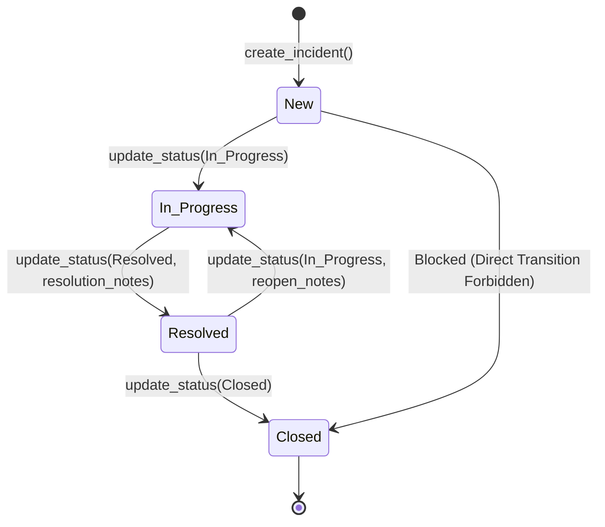

#### 6.2.2. Duplication & Spam Prevention
* Prior to executing `create_incident`, the adapter queries active tickets for `requestor_employee_id` created within the last 15 minutes. If a matching ticket with the same `category` and similar `short_description` (cosine similarity $> 0.85$) exists, ticket creation is halted with an alert to the user.

#### 6.2.3. ITSM Rate Limiting & Quota Management
* **API Quota Thresholds:**
  - **Sustained Rate Limit:** 120 requests/minute (2.0 req/sec).
  - **Burst Capacity:** Maximum 25 concurrent requests over a 5-second window.
  - **Limiter Mechanism:** Sliding Window Log in Redis (`ratelimit:serviceimmediately:{tenant_id}`).
* **Backpressure Handling:** In the event of downstream HTTP 429 responses, non-blocking ticket timeline comments are deferred to the resilient background retry queue (Section 10.1).

---

### 6.3. Policy Knowledge & RAG Subsystem

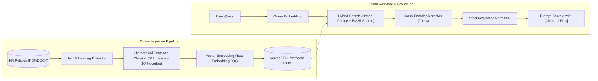

* **Ingestion Metadata Schema**:
  ```json
  {
    "chunk_id": "pol-leave-v2-042",
    "document_id": "DOC-POL-LEAVE-2026",
    "document_title": "Enterprise Employee Leave & Absence Policy 2026",
    "document_version": "2.4",
    "section_heading": "Section 4.2 - Bereavement and Compassionate Leave",
    "deep_link_url": "https://hr.corp.internal/policies/leave#sec-4.2",
    "access_roles": ["Employee", "Manager", "HR_Admin"],
    "security_classification": "Internal",
    "is_deleted": false,
    "last_compliance_audit": "2026-09-01T00:00:00Z",
    "content": "Employees are eligible for up to 5 consecutive business days of paid bereavement leave..."
  }
  ```

#### 6.3.1. Dynamic Metadata-Driven RBAC & Vector Permission Synchronization
To prevent unauthorized access to sensitive or executive-tier HR policies (e.g., severance guidelines, executive relocation bands) and satisfy Data Protection Officer (DPO) governance requirements:
* **Query-Time Metadata Pre-Filtering:**
  - Ingested policy chunks carry explicit role access lists (`access_roles`) and classification tags (`security_classification`).
  - At query execution time, the `PolicyRAGService` retrieves the authenticated caller's verified role claims from the session security context (e.g., `caller_roles = ["Employee"]`).
  - The vector retrieval query enforces a deterministic pre-filter constraint prior to approximate nearest neighbor (ANN) search:
    ```sql
    WHERE is_deleted = false 
      AND access_roles && :caller_roles 
      AND (security_classification != 'Confidential' OR 'HR_Admin' = ANY(:caller_roles))
    ```
  - Unauthorized policy chunks are mathematically excluded from the search candidate pool, preventing cross-role policy leakage.
* **Real-Time Role Revocation & Clearance Synchronization:**
  - When an employee's organizational role, department, or supervisory status changes in WorkWeek, an event (`employee.role.updated`) is published to the agentic platform.
  - The `TenantSecurityManager` immediately invalidates the user's active role cache in Redis (`user:roles:{emp_id}`).
  - Subsequent conversational turns instantly reflect the updated claims, ensuring permission changes propagate to policy retrieval within $< 1.0\text{ second}$.

#### 6.3.2. GDPR Article 17 Right-to-be-Forgotten & Vector Purge Protocol
To guarantee compliance with GDPR Article 17 (Right to Erasure) and prevent stale or personal employee data from persisting in semantic vector spaces:
* **Zero-PII Ingestion Gate:**
  - All source policy documents pass through an automated offline Presidio NER scanning worker prior to chunking.
  - Any detected employee names, emails, phone numbers, or personal identifying attributes trigger an ingestion quarantine alert, preventing PII from ever being embedded into vectors.
* **Vector Purging Pipeline (`Right-to-be-Forgotten`):**
  - In the event an employee's personal information is identified in an uploaded policy appendix or custom operational document:
    1. **Trigger API:** Authorized DPO / Compliance Admin executes `POST /api/v1/compliance/purge-embeddings` with `entity_id` or `document_id`.
    2. **Immediate Soft Tombstoning ($< 500\text{ms}$):** The vector database sets `is_deleted = true` on all matching chunks. The pre-filter immediately removes these chunks from all user queries in real-time.
    3. **Physical Vector Purge ($< 24\text{ hours}$):** A background compaction worker permanently drops the soft-deleted vectors from the underlying HNSW/IVF index and triggers disk zeroization.
    4. **Compliance Audit Certificate:** An immutable record is emitted to Cloud Logging containing the deletion timestamp, document ID, entity hash, and count of purged embeddings for regulatory reporting.

---

## 7. Detailed Use Case Sequences & Cross-System Sagas

### 7.1. Single-Domain Policy Q&A (UC-1.1)

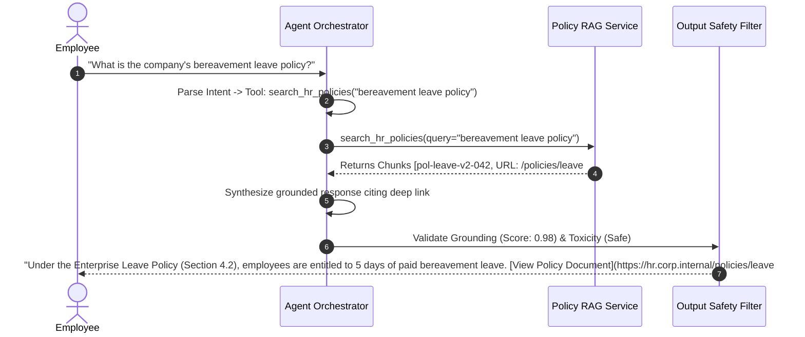

---

### 7.2. Cross-System Orchestration Saga: Medical Leave (UC-2.2)

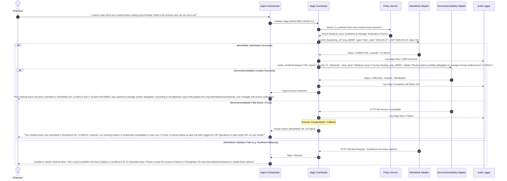

---

### 7.3. Cross-System Orchestration Saga: Equipment Procurement (UC-2.1)

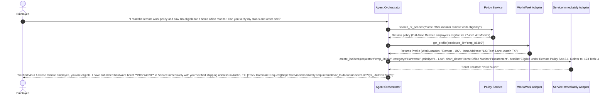

---

## 8. Data Model & Schema Specifications

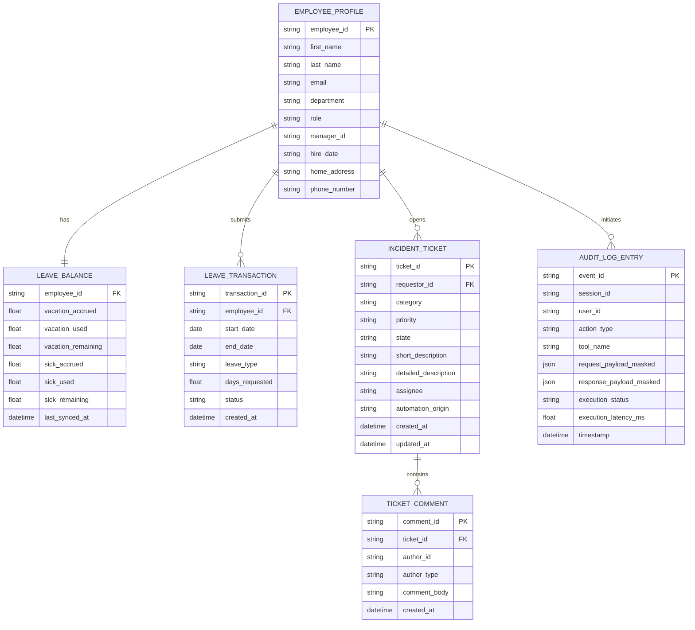

---

## 9. Security, Governance & Compliance Architecture

### 9.1. Identity Context & RBAC Matrix

| Role / Context | Policy Q&A Access | WorkWeek Read (Profile/PTO) | WorkWeek Write (Contact/Leave) | ServiceImmediately Read | ServiceImmediately Write (Create/Comment/Status) |
| :--- | :--- | :--- | :--- | :--- | :--- |
| **Authenticated Employee** | ✅ Full Curated Policies | ✅ Self Record Only | ✅ Self Record Only | ✅ Self Incidents Only | ✅ Self Incidents Only |
| **Cross-Employee Lookup** | ❌ Forbidden | ❌ Forbidden | ❌ Forbidden | ❌ Forbidden | ❌ Forbidden |
| **System/Admin Operations** | ❌ Blocked in MVP 1 | ❌ Blocked in MVP 1 | ❌ Blocked in MVP 1 | ❌ Blocked in MVP 1 | ❌ Blocked in MVP 1 |

#### 9.1.1. Real-Time OAuth & On-Behalf-Of (OBO) Token Revocation Architecture
To maintain system security during employee offboarding, role termination, or credential compromise, the platform enforces a sub-second revocation propagation pipeline:

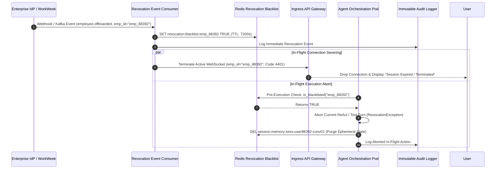

* **Revocation Latency:** Full propagation from IdP webhook receipt to active session termination and token invalidation completes in $\le 200\text{ ms}$.
* **OBO Token Guard:** All downstream tool adapters check the Redis revocation key immediately prior to dispatching HTTP requests to WorkWeek or ServiceImmediately. If flagged, the tool invocation is aborted without touching enterprise APIs.

### 9.2. Immutable Audit Logging Specification
All user actions, tool executions, safety blocks, and LLM reasoning completions write asynchronously to a write-only Elasticsearch / Cloud Logging audit cluster.

#### 9.2.1. Tool Execution Audit Log Event (Masked)
```json
{
  "timestamp": "2026-09-01T09:28:15.120Z",
  "event_id": "evt-77382-9901-44af",
  "session_id": "sess-user88392-conv01",
  "user_id": "emp_8839201",
  "action_type": "TOOL_EXECUTION",
  "tool_name": "workweek_submit_leave_request",
  "request_origin": {
    "ip_address": "10.240.12.88",
    "user_agent": "EnterpriseChatClient/4.2",
    "verified_automation_source": "HR-Agentic-Solution-MVP1"
  },
  "safety_evaluation": {
    "input_guard_passed": true,
    "prompt_injection_score": 0.012,
    "topic_domain": "HR_SELF_SERVICE"
  },
  "payload_masked": {
    "leave_type": "Vacation",
    "start_date": "2026-09-10",
    "end_date": "2026-09-11",
    "days_requested": 2.0
  },
  "execution_status": "SUCCESS",
  "execution_latency_ms": 284.5
}
```

#### 9.2.2. GDPR Article 17 Purge Audit Log Event
```json
{
  "timestamp": "2026-09-01T11:45:00.000Z",
  "event_id": "evt-purge-99214-gdpr",
  "action_type": "COMPLIANCE_PURGE",
  "regulatory_standard": "GDPR_ARTICLE_17_RIGHT_TO_ERASURE",
  "requester_id": "dpo_officer_44",
  "target_entity_hash": "sha256:e3b0c44298fc1c149afbf4c8996fb92427ae41e4649b934ca495991b7852b855",
  "action_details": {
    "operation": "VECTOR_EMBEDDING_PURGE",
    "document_id": "DOC-POL-LEAVE-2026",
    "soft_tombstone_latency_ms": 142.0,
    "chunks_purged": 14,
    "physical_vacuum_scheduled": "2026-09-02T02:00:00Z"
  },
  "status": "PURGED_AND_CERTIFIED"
}
```

---

## 10. Resilience, Fault Tolerance & Risk Management

### 10.1. Transient Fault Strategy (Circuit Breaker & Exponential Backoff)
All integration calls to external APIs (WorkWeek and ServiceImmediately) are wrapped in a resilient policy:
* **Max Retries**: 3 attempts.
* **Backoff Strategy**: Exponential with jitter: $T_{\text{wait}} = 200\text{ms} \times 2^{\text{retry}} \pm \text{jitter}(50\text{ms})$.
* **Circuit Breaker**: Trips to `OPEN` if $\ge 50\%$ of calls fail over a 30-second rolling window. While open, fails fast with user-friendly notification.

### 10.2. Error Sanitization Rule
Internal system errors, HTTP 500 responses, and database stack traces are intercepted at the gateway. The user receives clear, actionable messages:
* *Downstream Unavailable*: `"Our HR system (WorkWeek) is temporarily undergoing maintenance. Please retry in a few minutes."`
* *Resource Not Found*: `"We could not locate ticket INC123456. Please verify the ticket ID number."`

### 10.3. Extended Third-Party API Outage & Degraded-Mode Architecture
To maintain business continuity during extended outages ($> 5\text{ minutes}$) of external SaaS platforms (WorkWeek or ServiceImmediately):

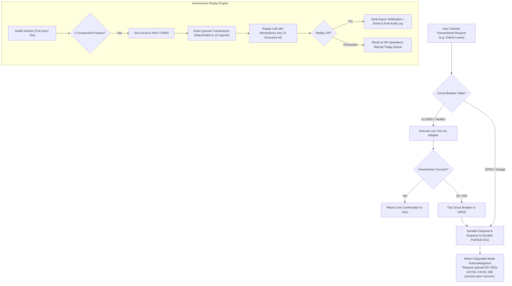

* **Policy Q&A Isolation:** Curated policy queries operate with 100% independence from WorkWeek and ServiceImmediately, remaining fully functional throughout SaaS downtime.
* **Idempotency Guarantee:** All queued replay transactions include the original cryptographic `X-Execution-Id` to guarantee that recovering downstream APIs never execute duplicate transactions.

### 10.4. Categorized Risk Register
The following matrix evaluates potential technical, operational, and organizational failure modes along with active mitigations and engineering owners:

| Risk ID | Category | Risk Description | Likelihood | Impact | Mitigation Strategy | Owner |
| :--- | :--- | :--- | :---: | :---: | :--- | :--- |
| **RSK-01** | Technical | **WorkWeek API Throttling & Sandbox Concurrency Limits**: Peak submission surges trigger HTTP 429 errors due to sandbox concurrency limits. | Medium | High | Token bucket rate limiter (Sec 6.1.3), 30-connection pool ceiling, and proactive backpressure throttling. | Backend Integration Lead |
| **RSK-02** | Technical | **LLM Policy Hallucination**: Edge-case policy interpretations yield inaccurate employee guidance. | Low | High | Strict RAG pipeline with dual-threshold entailment check ($>0.90$ score); system strictly states inability to answer if context is absent. | AI Architect |
| **RSK-03** | Security | **Adversarial Prompt Injection / Jailbreak**: Malicious prompts attempt system prompt exfiltration or unauthorized tool calls. | Medium | High | Dual-boundary safety scanning (<150ms input guard) with regex signature + semantic classifier blocking prompt manipulation prior to LLM ingress. | Security Lead |
| **RSK-04** | Security | **Stale OAuth / OBO Tokens on Employee Offboarding**: Delayed de-provisioning allows former employees continued access. | Medium | High | Sub-second real-time revocation pipeline via IdP webhook and Redis blacklist (`revocation:blacklist:{emp_id}`) severing sessions in $\le 200\text{ms}$ (Sec 9.1.1). | Security & Identity Lead |
| **RSK-05** | Compliance | **GDPR Right-to-be-Forgotten Embedding Persistence**: Personal employee data inadvertently embedded into vector index violates Article 17. | Low | High | Ingestion zero-PII Presidio gate + automated Purge API with $<500\text{ms}$ soft-tombstoning and 24h physical partition vacuuming (Sec 6.3.2). | Data Protection Officer (DPO) |
| **RSK-06** | Operational | **Extended Third-Party SaaS Outage**: WorkWeek or ServiceImmediately down for multiple hours. | Medium | Medium | Degraded-mode operation with durable Pub/Sub asynchronous queue and automated rate-limited reconciliation engine (Sec 10.3). | Core Platform Lead |
| **RSK-07** | Operational | **Policy Document Staleness / Drift**: Ingested policy vectors become out of sync with updated corporate PDFs. | Medium | Low | Document Ingestion Worker computes SHA-256 hashes on source PDFs every 60 minutes, auto-updating outdated chunks within 1 hour (FR-5.5). | Data Ops Lead |
| **RSK-08** | Dependency | **Sandbox / Test Credential Expiry**: Functional service tokens expire during evaluation or pilot testing. | Low | High | Automated token health checks at application startup with alerting to infrastructure team 7 days prior to credential expiration. | DevOps Lead |

### 10.5. Known Unknowns Register
* **WorkWeek Sandbox Concurrency Ceiling:** The exact synthetic concurrency limit of the single-tenant WorkWeek sandbox before throttling begins is undocumented by the vendor. *Investigation Plan:* Execute automated Locust stepping ramp tests (from 5 to 50 concurrent requests) in Sprint 3 to establish the empirical throttle cliff.
* **Complex Multi-Column PDF Table Chunking Quality:** Unstructured tabular data within compensation or leave appendices can lose semantic structure during basic chunking. *Investigation Plan:* Evaluate specialized markdown/table extractors against 50 benchmark policy questions in Phase 1.

---

## 11. Non-Functional Requirements (NFR) Budget & Operational Models

### 11.1. Response Latency Performance Budget
```
Total Response Latency Budget: <= 10.00 Seconds
+-----------------------------------------------------------------------------------------+
| Ingress / Session Context : 0.05s                                                      |
| Input Safety Guard        : 0.15s  (Budget: <= 0.30s total safety scan)                |
| Vector RAG / Tool Fetch   : 0.80s                                                      |
| LLM Reasoning & Gen       : 3.50s - 6.00s                                              |
| Output Safety & SPII Scan : 0.15s                                                      |
| Egress / Streaming Render : 0.05s                                                      |
+-----------------------------------------------------------------------------------------+
Total Typical Roundtrip: 4.65s - 7.15s (Comfortably under 10.0s SLA)
```

### 11.2. Infrastructure & LLM Token Cost Model (MVP 1 Projection)
To ensure financial predictability, projected operational costs are modeled for a baseline workload of **10,000 conversational interactions per month**:

| Cost Component | Unit Metric / Usage Profile | Cost Driver / Rate | Projected Monthly Cost (USD) |
| :--- | :--- | :--- | :--- |
| **LLM Inference (Reasoning & Generation)** | Avg. 1,200 prompt tokens + 350 output tokens per turn (~15.5M total tokens/mo) | Input: $0.15 / 1M tokens<br>Output: $0.60 / 1M tokens | ~$4.00 – $6.50 / month |
| **RAG Embedding Ingestion & Queries** | 200 policy documents (~1M tokens one-time) + 10,000 query embeddings/mo | Text-Embedding-004: $0.025 / 1M tokens | < $0.50 / month |
| **Vector DB & Session Cache** | Milvus / pgvector instance + Redis cluster (1GB RAM) | Cloud container runtime allocation | ~$45.00 – $75.00 / month |
| **Application Runtime (Kubernetes / Cloud Run)** | 2 vCPU, 4GB RAM containerized stateless worker instances | Containerized Cloud compute | ~$60.00 – $100.00 / month |
| **Total Estimated Operational Cost** | **10,000 queries / month** | **Full Infrastructure & Model Costs** | **~$110.00 – $182.00 / month** |

### 11.3. Availability, Disaster Recovery & High Availability (HA) Model
* **Availability Target (NFR-2.2):** **99.9% Uptime** ($< 43.8$ minutes of unscheduled downtime per month).
* **High Availability (HA) Topology:**
  - Stateless agent worker pods deployed across $\ge 2$ Availability Zones (AZs) behind a managed Cloud Application Load Balancer.
  - Ephemeral Redis session cache configured with Multi-AZ replication and automated failover.
* **Disaster Recovery (DR) Metrics:**
  - **Recovery Time Objective (RTO):** $\le 1\text{ hour}$ (automated container re-provisioning via Terraform / Helm).
  - **Recovery Point Objective (RPO):** $\le 15\text{ minutes}$ (Vector index snapshots backed up hourly; transactional state remains in upstream source systems WorkWeek and ServiceImmediately).

---

## 12. Verification, Evaluation & Test Plan

| Test Phase | Test Scope / Scenario | Verification Methodology | Target Success Benchmark |
| :--- | :--- | :--- | :--- |
| **Unit Testing** | Individual tool input schema validators, date calculators, regex formatters | PyTest / Jest automated suites with 100% mocked backends | 100% Test Pass Rate |
| **Security Red Teaming** | 200+ Prompt injection, jailbreak, role hijacking, and SQL/Command injection prompts | Automated adversarial probe runner | 100% Interception Rate; 0 Leaks |
| **Grounding Benchmark** | 50 curated complex policy questions against ingested HR documents | RAG Triad Metrics (Context Relevance, Groundedness, Answer Relevance) | $\ge 95\%$ Grounding Score; 0% Hallucination |
| **End-to-End Sagas** | Complex multi-system scenarios (UC-2.1, UC-2.2, UC-2.3) with simulated partial drops | Integration test harness validating compensation and state consistency | 100% Transaction Correctness |
| **Performance Stress** | Simulated 50 concurrent conversational turns | Locust / k6 load tests targeting `/api/v1/chat` | Average response latency $< 10.0\text{s}$, $P_{99} < 10\text{s}$ |

---

## 13. Implementation Plan, Phased Milestones & Resource Allocations

### 13.1. Phased Delivery Roadmap

```
Week 1 - 4: Phase 1 (Foundation & Policy RAG)
├── Sprint 1: Ingress API Gateway, Session Controller, Redis Setup
└── Sprint 2: Policy Ingestion Pipeline, Embedding, Dual-Layer Safety Guardrails
    └── [Milestone 1 Gate]: Grounded Policy Q&A with deep citations operational

Week 5 - 8: Phase 2 (Enterprise Adapters & Sagas)
├── Sprint 3: WorkWeek HCM Adapter (Read Profile/Balances, Submit Leave)
└── Sprint 4: ServiceImmediately ITSM Adapter & Cross-System Saga Coordinator
    └── [Milestone 2 Gate]: All 8 tools operational with multi-system Sagas passing

Week 9 - 12: Phase 3 (Hardening, Red Teaming & Pilot Rollout)
├── Sprint 5: Security Red-Teaming (200+ probes), RAG Triad Benchmarking
└── Sprint 6: Performance Load Testing (50 concurrent users), Pilot Rollout (100 users)
    └── [Milestone 3 Gate]: Production MVP 1 Go-Live and Acceptance Sign-off
```

| Phase | Duration | Key Deliverables | Dependencies | Exit Milestone Gate |
| :--- | :---: | :--- | :--- | :--- |
| **Phase 1: Foundation & Policy RAG** | Weeks 1–4 | Ingress Gateway, Dual-Layer Safety Filters, SPII Masker, Document Parser, Vector Store, Hybrid Retrieval Pipeline. | Policy PDF repository access. | **M1:** Policy Q&A achieving $\ge 95\%$ grounding on 50 benchmark queries with $<300\text{ms}$ safety latency. |
| **Phase 2: Enterprise Adapters & Sagas** | Weeks 5–8 | WorkWeek Adapter (delegated headers), ServiceImmediately Adapter (state machine), Cross-System Saga Coordinator (UC-2.1, UC-2.2, UC-2.3). | Functional test credentials for WorkWeek & ServiceImmediately. | **M2:** 100% pass rate on integration test suites for all 8 tool schemas and compensating sagas. |
| **Phase 3: Hardening, Benchmarking & Pilot** | Weeks 9–12 | 200+ Adversarial red-team probes, Locust load tests (50 concurrent turns), Pilot deployment to 100 enterprise users, Audit logging verification. | Phase 1 & Phase 2 sign-offs. | **M3:** 0 security leaks, $P_{99} < 10.0\text{s}$ latency, and business acceptance sign-off for MVP 1. |

### 13.2. Resource Allocation & Staffing Model
The implementation requires a focused engineering pod across 12 weeks:

| Role | Headcount / Allocation | Primary Responsibilities |
| :--- | :---: | :--- |
| **Lead AI Software Architect** | 0.5 FTE (12 wks) | Overall architectural governance, LLM prompting/tool schemas, security red-teaming design. |
| **Senior Backend Integration Engineer** | 1.0 FTE (12 wks) | WorkWeek & ServiceImmediately REST adapters, delegated auth headers, state machine enforcement. |
| **Core Platform & Saga Engineer** | 1.0 FTE (12 wks) | ReAct orchestrator loop, Saga Coordinator, compensating transaction logic, Redis session state. |
| **AI / RAG Engineer** | 1.0 FTE (8 wks - Ph 1 & 3) | Hierarchical document chunking, hybrid vector search, cross-encoder reranker, grounding evaluator. |
| **QA / Security Automation Engineer** | 1.0 FTE (8 wks - Ph 2 & 3) | Automated red-teaming test harness, Locust performance stress tests, end-to-end saga simulation. |

---

## 14. Open Questions & Future Architecture Considerations

The following architectural questions and evolutionary capabilities are cataloged for post-MVP 1 planning:

1. **Enterprise Identity Federation (SSO):**
   - *Question:* How will the system transition from MVP 1 functional test credentials to delegated OAuth2 OIDC / SAML tokens (e.g., Okta, Azure AD) without breaking the `X-Delegated-User-Id` propagation contract?
   - *Resolution Plan:* Architecture spike scheduled for Phase 3 to evaluate JWT token exchange via OAuth 2.0 Token Exchange (RFC 8693).
2. **Multi-Tenant Enterprise Partitioning:**
   - *Question:* If rolled out across subsidiary business units with isolated HCM/ITSM tenants, should data isolation rely on database schema partitioning or separate tenant agent clusters?
   - *Resolution Plan:* Evaluated for MVP 2 architecture based on enterprise compliance requirements.
3. **Human-in-the-Loop Escalation Routing:**
   - *Question:* When the grounding evaluator scores policy answer confidence between 0.70 and 0.89 (ambiguous policy nuance), should the agent offer an automatic warm transfer / ticket escalation to an HR specialist?
   - *Resolution Plan:* Interface hook designed in `serviceimmediately_create_incident` to allow 1-click fallback ticket creation if user expresses dissatisfaction with an ambiguous policy answer.

---

## 15. Appendices & References
* **BRD Reference**: [HR_Agentic_Solution_BRD.md](file:///usr/local/google/home/lufengsh/ai_advanced/lab3/HR_Agentic_Solution_BRD.md)
* **Architecture Standard**: IEEE 1016-2009 (Standard for Information Technology - Systems Design - Software Design Descriptions)
