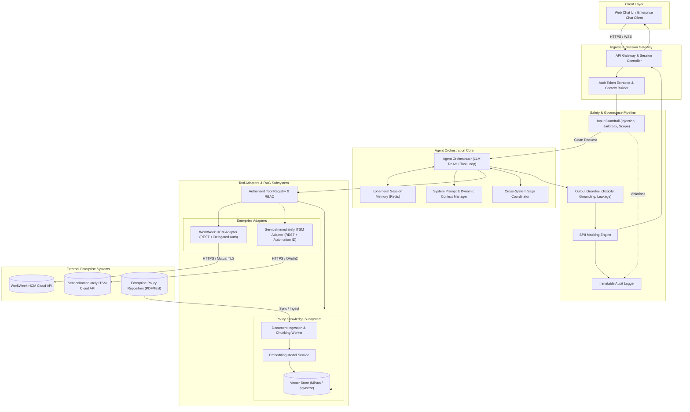
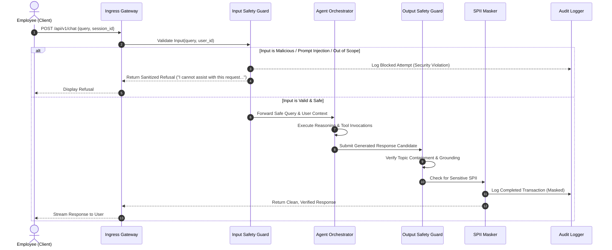
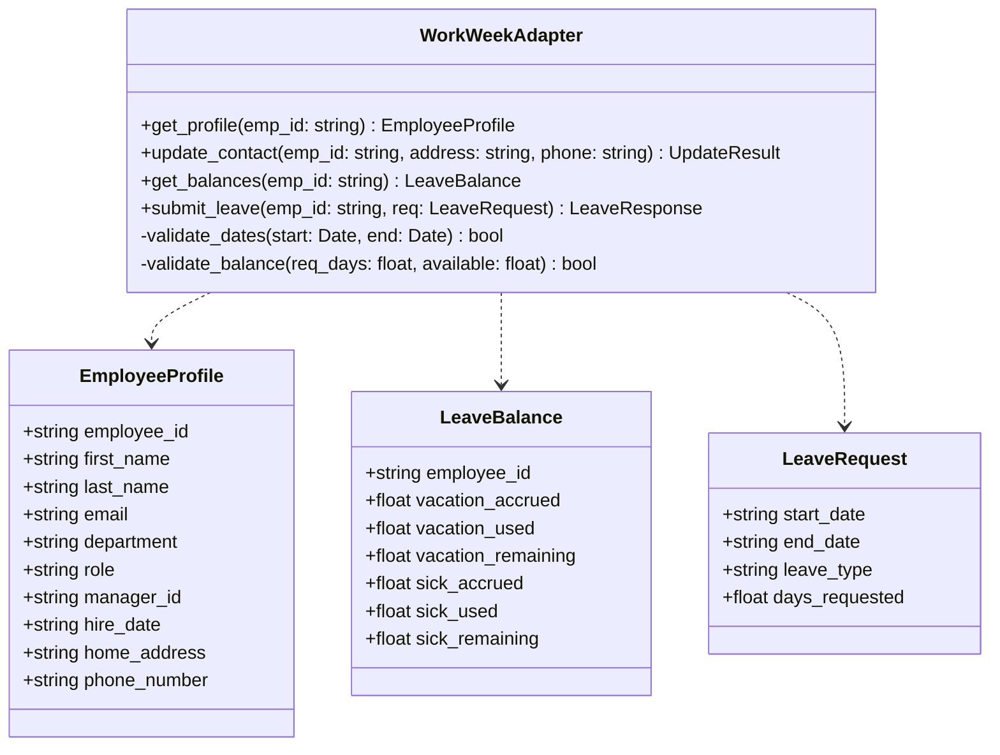
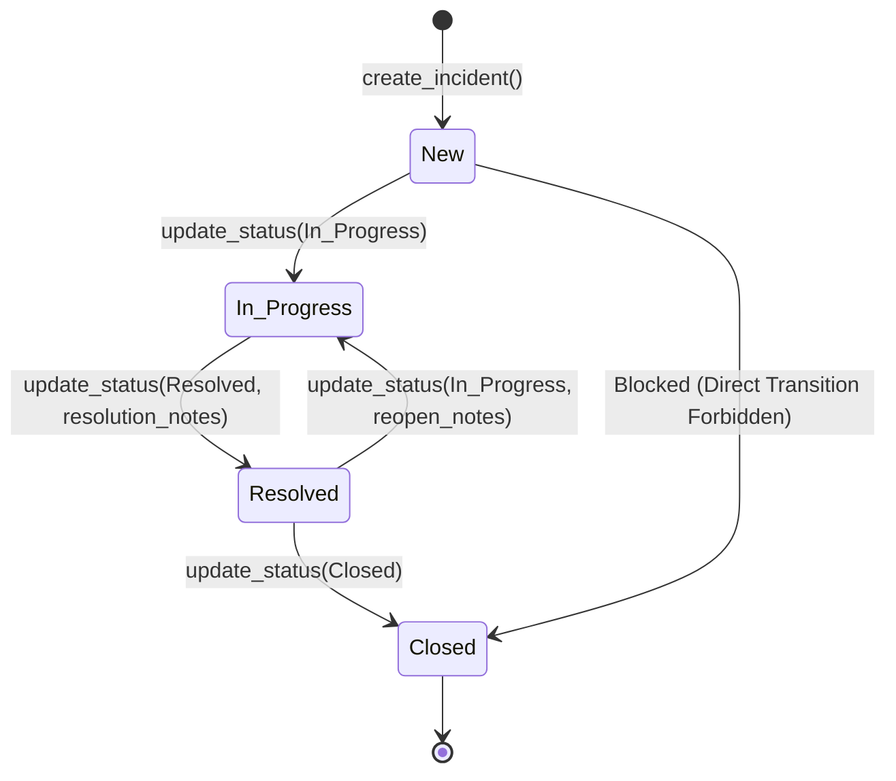
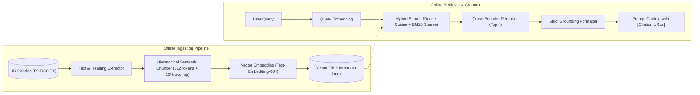
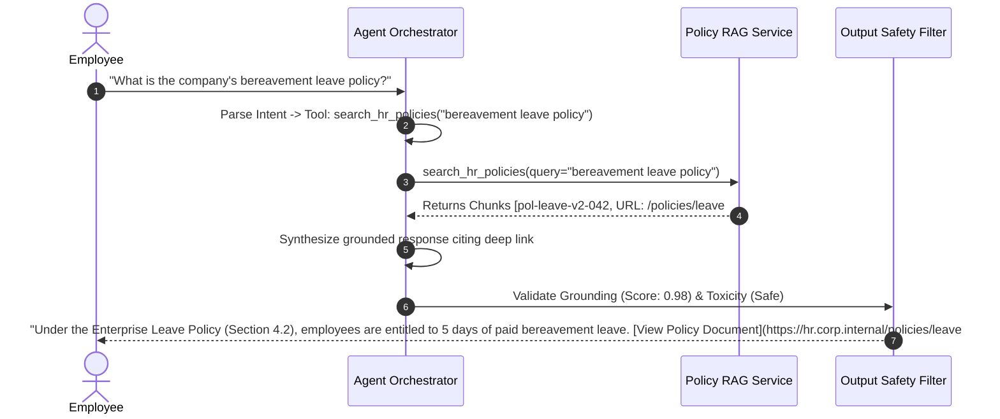
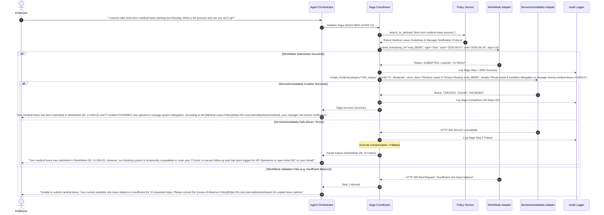
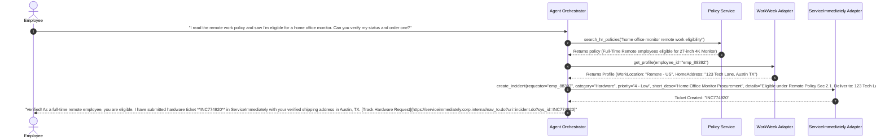
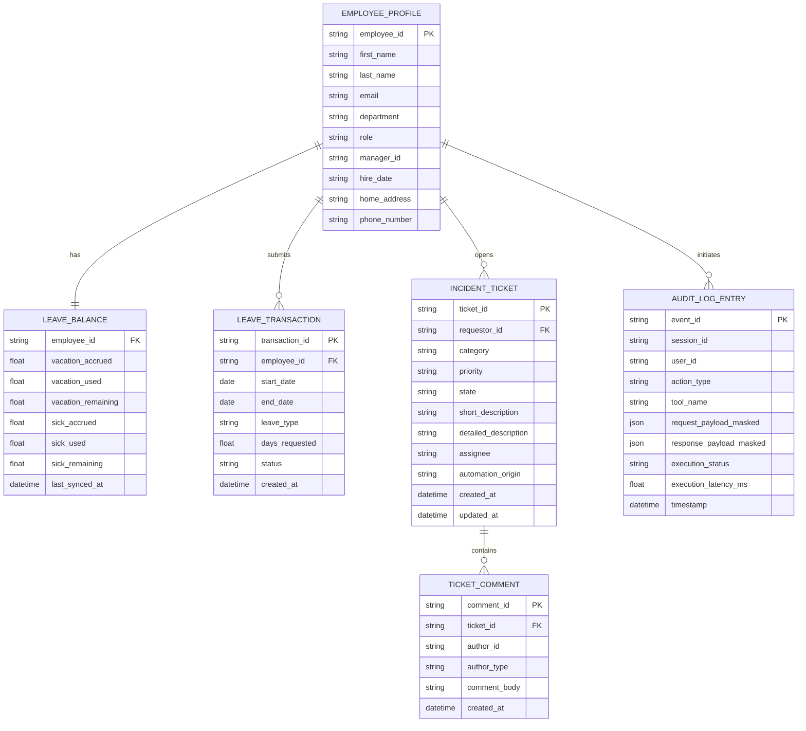

# Software Design Document (SDD)
## HR Agentic Solution (MVP 1)

---

### Document Control

| Attribute | Value |
| :--- | :--- |
| **Document Title** | Software Design Document: HR Agentic Solution (MVP 1) |
| **Document Version** | 1.0.0 |
| **Status** | Approved / Ready for Implementation |
| **Author** | Senior AI Software Architect |
| **Target Baseline** | Business Requirements Document (BRD) - HR Agentic Solution (MVP 1) |
| **Target Environment** | Single-Tenant Cloud/Enterprise Containerized Infrastructure |

---

## 1. Executive Summary & System Overview

### 1.1. System Overview
The **HR Agentic Solution** is an enterprise-grade, conversational artificial intelligence system designed to automate Tier 1 Human Resources (HR) and Information Technology (IT) inquiries, streamline self-service transactional workflows, and execute cross-system orchestrations. 

By leveraging modern Large Language Model (LLM) reasoning capabilities paired with strict deterministic guardrails, the system mediates user requests across:
1. **Curated HR Policy Knowledge Base**: Grounded retrieval-augmented generation (RAG) providing verifiable citations.
2. **WorkWeek (HCM)**: Enterprise Human Capital Management system for personal employee profiles and Paid Time Off (PTO) management.
3. **ServiceImmediately (ITSM/HRSD)**: Enterprise service management platform for incident tracking, ticketing, and workflow execution.

### 1.2. Architecture Principles
* **Zero-Trust AI & Request Origin Verification**: Every tool invocation and downstream API execution validates delegated user identity and tags requests with verifiable automation provenance.
* **Strict Grounding & Bounded Execution**: The agent cannot execute arbitrary code or call unauthorized tools; policy questions are strictly bounded by retrieved knowledge chunks with 0% tolerated hallucination.
* **Real-time Ephemeral Data Fetching**: No Personally Identifiable Information (PII) or dynamic transactional data is cached long-term in the conversational orchestration layer.
* **Dual-Boundary Safety Interception**: Fast-path (<300ms) input/output scanning prevents prompt injections, jailbreaks, data exfiltration, and toxic generation before reaching the LLM or end-user.
* **Compensating Orchestration (Sagas)**: Multi-step cross-system workflows implement compensating transactions and clear audit tracking to maintain data consistency upon partial failures.

---

## 2. Traceability Matrix (BRD Requirements to Architecture Modules)

| BRD Requirement ID | Requirement Description | SDD Design Module / Component |
| :--- | :--- | :--- |
| **FR-1.1** | Capability & Lifecycle Governance | Tool Registry & Capability Controller (`ToolRegistry`, `RBACValidator`) |
| **FR-1.2** | Verification of Request Origin | Delegated Identity & Origin Header Engine (`IdentityContextInjector`) |
| **FR-1.3** | Conversation Safety (Input/Output) | Dual-Layer Dynamic Guardrail Pipeline (`InputSafetyFilter`, `OutputSafetyFilter`) |
| **FR-1.4** | Data Masking / Redaction | PII/SPII Redaction Engine (`SPIIMasker`) |
| **FR-1.5** | RBAC and Data Isolation | Session & Scope Enforcement Layer (`TenantSecurityManager`) |
| **FR-2.1, FR-2.2** | NLU & Multi-Turn Dialog | Agent Reasoning Core & Ephemeral Dialog State Manager (`AgentOrchestrator`) |
| **FR-3.1 - FR-3.4** | WorkWeek HCM Integration | WorkWeek Integration Adapter & Guardrails (`WorkWeekAdapter`) |
| **FR-4.1 - FR-4.3** | ServiceImmediately ITSM Integration | ServiceImmediately Integration Adapter & Guardrails (`ServiceImmediatelyAdapter`) |
| **FR-5.1 - FR-5.5** | Policy Document Q&A & Ingestion | RAG Knowledge Engine & Vector Store (`PolicyRAGService`) |
| **NFR-1.1 - NFR-1.3** | Security, Privacy & Auditing | Immutable Structured Audit Logging Engine (`AuditLogger`) |
| **NFR-2.1 - NFR-2.3** | Latency, Availability, Async | Asynchronous Tool Dispatcher & Streaming Ingress Gateway |
| **NFR-3.1** | Grounding & Zero Hallucination | Self-Reflective Hallucination Checker (`GroundingEvaluator`) |
| **NFR-4.1 - NFR-4.3** | Resilience & Sagas | Resilient Retry Circuit Breaker & Saga Orchestrator (`SagaManager`) |

---

## 3. High-Level System Architecture

The solution adopts a modular, layered service-oriented architecture comprising an Ingress Layer, Safety & Governance Layer, Agent Orchestration Core, Retrieval & Tool Adapters, and Enterprise Backend Systems.



---

## 4. Component Deep Dive & Subsystem Design

### 4.1. Ingress & Session Gateway
* **Protocol**: WebSocket (for streaming tokens and low-latency interaction) with fallback to HTTPS REST (`/api/v1/chat`).
* **Session Controller**: Maintains lightweight session descriptors (`session_id`, `user_id`, `created_at`, `ttl`).
* **Authentication Context Builder**: Extracts user functional test credentials/tokens, injecting verified `EmployeeID` into the thread-safe request context.

### 4.2. Dual-Layer Dynamic Guardrails & Safety Architecture



#### 4.2.1. Input Safety Filter (`InputSafetyFilter`)
* **Execution Budget**: $\le 150\text{ ms}$.
* **Mechanism**:
  1. **Pattern & Signature Scanner**: Regex/heuristics for prompt injection tokens (e.g., `IGNORE ALL PREVIOUS INSTRUCTIONS`, `System Prompt Override`, `DAN Mode`).
  2. **Semantic Safety Classifier**: Lightweight embedding classifier scoring malicious intent probability ($P_{\text{injection}} > 0.85 \implies \text{Block}$).
  3. **Domain Boundary Verifier**: Zero-shot classifier ensuring user intent is within HR policies, WorkWeek HCM, or ServiceImmediately ITSM domains.

#### 4.2.2. Output Safety & Grounding Verifier (`OutputSafetyFilter`)
* **Execution Budget**: $\le 150\text{ ms}$.
* **Mechanism**:
  1. **Toxicity & Brand Safety Scanner**: Filters profanity, bias, and inappropriate content.
  2. **Grounding Evaluator**: For policy answers, performs automated verification that every factual statement has an entailment score $> 0.90$ against retrieved context chunks.
  3. **SPII Masking Engine (`SPIIMasker`)**: Detects Social Security Numbers (SSN), Government IDs, Credit Cards, and Personal Phone Numbers/Home Addresses in logs using Named Entity Recognition (NER) + regex patterns.

---

## 5. Agent Orchestration Core & Tool Registry

### 5.1. Execution Model (ReAct Loop)
The agent operates on an iterative **Thought $\rightarrow$ Action $\rightarrow$ Observation $\rightarrow$ Final Answer** cycle.

```
       +-----------------------+
       |   User Query Input    |
       +-----------+-----------+
                   |
                   v
+------------------+-------------------+
|     Dynamic Prompt Construction       |
| (System Rules + Grounding + Tools)    |
+------------------+-------------------+
                   |
                   v
+------------------+-------------------+ <-------+
|        LLM Inference Step             |         |
| (Determines Direct Reply or Tool Call)|         |
+------------------+-------------------+         |
                   |                             |
       +-----------+-----------+                 |
       | Tool Call Generated?  |                 |
       +-----------+-----------+                 |
       | YES                   | NO              |
       v                       v                 |
+------+---------------+ +-----+---------------+ |
| Tool Parameter Guard | | Formulate Response  | |
+------+---------------+ +-----+---------------+ |
       |                       |                 |
       v                       v                 |
+------+---------------+ +-----+---------------+ |
| Execute Tool Adapter | | Output Guard Scan   | |
+------+---------------+ +-----+---------------+ |
       |                       |                 |
       v                       v                 |
+------+---------------+ +-----+---------------+ |
| Observation Ingestion| | Return to User / End| |
+------+---------------+ +---------------------+ |
       |                                         |
       +-----------------------------------------+
```

### 5.2. Tool Registry & Functional Specifications

All tools are exposed to the LLM via strict schema definitions (OpenAI / Gemini function calling format):

```json
[
  {
    "name": "search_hr_policies",
    "description": "Searches curated HR policy documents using semantic retrieval. Returns grounded text passages with deep links and section citations.",
    "parameters": {
      "type": "object",
      "properties": {
        "query": { "type": "string", "description": "Natural language policy search query." },
        "top_k": { "type": "integer", "default": 4, "description": "Number of relevant chunks to retrieve." }
      },
      "required": ["query"]
    }
  },
  {
    "name": "workweek_get_employee_profile",
    "description": "Retrieves the caller's employee profile information from WorkWeek HCM (Name, Department, Role, Manager, Contact details).",
    "parameters": {
      "type": "object",
      "properties": {
        "employee_id": { "type": "string", "description": "Verified Employee ID of the caller." }
      },
      "required": ["employee_id"]
    }
  },
  {
    "name": "workweek_update_contact_info",
    "description": "Updates personal contact information (address, phone number) for the employee in WorkWeek HCM.",
    "parameters": {
      "type": "object",
      "properties": {
        "employee_id": { "type": "string", "description": "Verified Employee ID." },
        "address": { "type": "string", "description": "Updated home address string (optional)." },
        "phone_number": { "type": "string", "description": "Updated personal phone number in E.164 format (optional)." }
      },
      "required": ["employee_id"]
    }
  },
  {
    "name": "workweek_get_leave_balances",
    "description": "Retrieves accrued, used, and remaining PTO balances (Vacation and Sick) for the employee.",
    "parameters": {
      "type": "object",
      "properties": {
        "employee_id": { "type": "string", "description": "Verified Employee ID." }
      },
      "required": ["employee_id"]
    }
  },
  {
    "name": "workweek_submit_leave_request",
    "description": "Submits a formal leave of absence / PTO request into WorkWeek.",
    "parameters": {
      "type": "object",
      "properties": {
        "employee_id": { "type": "string", "description": "Verified Employee ID." },
        "start_date": { "type": "string", "format": "date", "description": "ISO 8601 start date (YYYY-MM-DD)." },
        "end_date": { "type": "string", "format": "date", "description": "ISO 8601 end date (YYYY-MM-DD)." },
        "leave_type": { "type": "string", "enum": ["Vacation", "Sick"], "description": "Category of leave." },
        "days_requested": { "type": "number", "description": "Total business days requested." }
      },
      "required": ["employee_id", "start_date", "end_date", "leave_type", "days_requested"]
    }
  },
  {
    "name": "serviceimmediately_get_ticket",
    "description": "Fetches current status, priority, category, assignee, and timeline notes for a ServiceImmediately incident ticket.",
    "parameters": {
      "type": "object",
      "properties": {
        "ticket_id": { "type": "string", "description": "Incident ticket ID (e.g., INC123456)." }
      },
      "required": ["ticket_id"]
    }
  },
  {
    "name": "serviceimmediately_create_incident",
    "description": "Creates a new support incident ticket in ServiceImmediately with provenance headers.",
    "parameters": {
      "type": "object",
      "properties": {
        "requestor_employee_id": { "type": "string", "description": "Employee ID on whose behalf the ticket is opened." },
        "category": { "type": "string", "enum": ["Hardware", "Software", "HR_Inquiry", "Facilities", "Network"], "description": "Ticket category." },
        "short_description": { "type": "string", "description": "Concise summary of the issue or request." },
        "detailed_description": { "type": "string", "description": "Full contextual details, policy references, and justification." },
        "priority": { "type": "string", "enum": ["1 - Critical", "2 - High", "3 - Moderate", "4 - Low"], "description": "Incident priority level." }
      },
      "required": ["requestor_employee_id", "category", "short_description", "detailed_description", "priority"]
    }
  },
  {
    "name": "serviceimmediately_post_comment",
    "description": "Appends an update comment or note to an existing ServiceImmediately ticket timeline.",
    "parameters": {
      "type": "object",
      "properties": {
        "ticket_id": { "type": "string", "description": "Target ticket ID." },
        "comment": { "type": "string", "description": "Comment body to append." }
      },
      "required": ["ticket_id", "comment"]
    }
  },
  {
    "name": "serviceimmediately_update_status",
    "description": "Updates lifecycle state of a ServiceImmediately ticket following valid transition rules.",
    "parameters": {
      "type": "object",
      "properties": {
        "ticket_id": { "type": "string", "description": "Target ticket ID." },
        "state": { "type": "string", "enum": ["In_Progress", "Resolved", "Closed"], "description": "Target lifecycle state." },
        "resolution_notes": { "type": "string", "description": "Mandatory notes if resolving/closing." }
      },
      "required": ["ticket_id", "state"]
    }
  }
]
```

---

## 6. Integration Adapters & Enterprise System Contracts

### 6.1. WorkWeek (HCM) Adapter Specification

#### 6.1.1. Delegated Authorization & Origin Verification
All outgoing HTTP requests from the WorkWeek Adapter append standard composite security headers:
```http
Authorization: Bearer <Functional_Service_Token>
X-Delegated-User-Id: emp_8839201
X-Automation-Origin: HR-Agentic-Solution-MVP1
X-Execution-Id: exec-482a-9fbc-1029384756af
```

#### 6.1.2. WorkWeek REST Endpoints & Operation Guardrails


* **Validation Rules**:
  1. $\text{start\_date} \ge \text{Today()}$ and $\text{end\_date} \ge \text{start\_date}$.
  2. $\text{days\_requested} \le \text{remaining\_balance}(\text{leave\_type})$.
  3. Strict E.164 phone formatting (`^\+[1-9]\d{1,14}$`).

---

### 6.2. ServiceImmediately (ITSM) Adapter Specification

#### 6.2.1. Incident Lifecycle State Machine
To satisfy **FR-4.3 (Transition Constraints)**, the adapter strictly enforces the following state transition matrix:



#### 6.2.2. Duplication & Spam Prevention
* Prior to executing `create_incident`, the adapter queries active tickets for `requestor_employee_id` created within the last 15 minutes. If a matching ticket with the same `category` and similar `short_description` (cosine similarity $> 0.85$) exists, ticket creation is halted with an alert to the user.

---

### 6.3. Policy Knowledge & RAG Subsystem



* **Ingestion Metadata Schema**:
  ```json
  {
    "chunk_id": "pol-leave-v2-042",
    "document_title": "Enterprise Employee Leave & Absence Policy 2026",
    "document_version": "2.4",
    "section_heading": "Section 4.2 - Bereavement and Compassionate Leave",
    "deep_link_url": "https://hr.corp.internal/policies/leave#sec-4.2",
    "content": "Employees are eligible for up to 5 consecutive business days of paid bereavement leave..."
  }
  ```

---

## 7. Detailed Use Case Sequences & Cross-System Sagas

### 7.1. Single-Domain Policy Q&A (UC-1.1)



---

### 7.2. Cross-System Orchestration Saga: Medical Leave (UC-2.2)



---

### 7.3. Cross-System Orchestration Saga: Equipment Procurement (UC-2.1)



---

## 8. Data Model & Schema Specifications



---

## 9. Security, Governance & Compliance Architecture

### 9.1. Identity Context & RBAC Matrix

| Role / Context | Policy Q&A Access | WorkWeek Read (Profile/PTO) | WorkWeek Write (Contact/Leave) | ServiceImmediately Read | ServiceImmediately Write (Create/Comment/Status) |
| :--- | :--- | :--- | :--- | :--- | :--- |
| **Authenticated Employee** | ✅ Full Curated Policies | ✅ Self Record Only | ✅ Self Record Only | ✅ Self Incidents Only | ✅ Self Incidents Only |
| **Cross-Employee Lookup** | ❌ Forbidden | ❌ Forbidden | ❌ Forbidden | ❌ Forbidden | ❌ Forbidden |
| **System/Admin Operations** | ❌ Blocked in MVP 1 | ❌ Blocked in MVP 1 | ❌ Blocked in MVP 1 | ❌ Blocked in MVP 1 | ❌ Blocked in MVP 1 |

### 9.2. Immutable Audit Logging Specification
All user actions, tool executions, safety blocks, and LLM reasoning completions write asynchronously to a write-only Elasticsearch / Cloud Logging audit cluster.

```json
{
  "timestamp": "2026-09-01T09:28:15.120Z",
  "event_id": "evt-77382-9901-44af",
  "session_id": "sess-user88392-conv01",
  "user_id": "emp_8839201",
  "action_type": "TOOL_EXECUTION",
  "tool_name": "workweek_submit_leave_request",
  "request_origin": {
    "ip_address": "10.240.12.88",
    "user_agent": "EnterpriseChatClient/4.2",
    "verified_automation_source": "HR-Agentic-Solution-MVP1"
  },
  "safety_evaluation": {
    "input_guard_passed": true,
    "prompt_injection_score": 0.012,
    "topic_domain": "HR_SELF_SERVICE"
  },
  "payload_masked": {
    "leave_type": "Vacation",
    "start_date": "2026-09-10",
    "end_date": "2026-09-11",
    "days_requested": 2.0
  },
  "execution_status": "SUCCESS",
  "execution_latency_ms": 284.5
}
```

---

## 10. Resilience, Fault Tolerance & Sagas

### 10.1. Transient Fault Strategy (Circuit Breaker & Exponential Backoff)
All integration calls to external APIs (WorkWeek and ServiceImmediately) are wrapped in a resilient policy:
* **Max Retries**: 3 attempts.
* **Backoff Strategy**: Exponential with jitter: $T_{\text{wait}} = 200\text{ms} \times 2^{\text{retry}} \pm \text{jitter}(50\text{ms})$.
* **Circuit Breaker**: Trips to `OPEN` if $\ge 50\%$ of calls fail over a 30-second rolling window. While open, fails fast with user-friendly notification.

### 10.2. Error Sanitization Rule
Internal system errors, HTTP 500 responses, and database stack traces are intercepted at the gateway. The user receives clear, actionable messages:
* *Downstream Unavailable*: `"Our HR system (WorkWeek) is temporarily undergoing maintenance. Please retry in a few minutes."`
* *Resource Not Found*: `"We could not locate ticket INC123456. Please verify the ticket ID number."`

---

## 11. Non-Functional Requirements (NFR) Performance Budget

```
Total Response Latency Budget: <= 10.00 Seconds
+-----------------------------------------------------------------------------------------+
| Ingress / Session Context : 0.05s                                                      |
| Input Safety Guard        : 0.15s  (Budget: <= 0.30s total safety scan)                |
| Vector RAG / Tool Fetch   : 0.80s                                                      |
| LLM Reasoning & Gen       : 3.50s - 6.00s                                              |
| Output Safety & SPII Scan : 0.15s                                                      |
| Egress / Streaming Render : 0.05s                                                      |
+-----------------------------------------------------------------------------------------+
Total Typical Roundtrip: 4.65s - 7.15s (Comfortably under 10.0s SLA)
```

---

## 12. Verification, Evaluation & Test Plan

| Test Phase | Test Scope / Scenario | Verification Methodology | Target Success Benchmark |
| :--- | :--- | :--- | :--- |
| **Unit Testing** | Individual tool input schema validators, date calculators, regex formatters | PyTest / Jest automated suites with 100% mocked backends | 100% Test Pass Rate |
| **Security Red Teaming** | 200+ Prompt injection, jailbreak, role hijacking, and SQL/Command injection prompts | Automated adversarial probe runner | 100% Interception Rate; 0 Leaks |
| **Grounding Benchmark** | 50 curated complex policy questions against ingested HR documents | RAG Triad Metrics (Context Relevance, Groundedness, Answer Relevance) | $\ge 95\%$ Grounding Score; 0% Hallucination |
| **End-to-End Sagas** | Complex multi-system scenarios (UC-2.1, UC-2.2, UC-2.3) with simulated partial drops | Integration test harness validating compensation and state consistency | 100% Transaction Correctness |
| **Performance Stress** | Simulated 50 concurrent conversational turns | Locust / k6 load tests targeting `/api/v1/chat` | Average response latency $< 10.0\text{s}$, $P_{99} < 10\text{s}$ |

---

## 13. Appendices & References
* **BRD Reference**: [HR_Agentic_Solution_BRD.md](file:///usr/local/google/home/lufengsh/ai_advanced/lab3/HR_Agentic_Solution_BRD.md)
* **Architecture Standard**: IEEE 1016-2009 (Standard for Information Technology - Systems Design - Software Design Descriptions)
