# Software Design Document (SDD)
## HR Agentic Solution (MVP 1)

---

### Document Control

| Attribute | Value |
| :--- | :--- |
| **Document Title** | Software Design Document: HR Agentic Solution (MVP 1) |
| **Document Version** | 1.2.0 |
| **Status** | Approved / Ready for Implementation |
| **Author** | Senior AI Software Architect |
| **Target Baseline** | Business Requirements Document (BRD) - HR Agentic Solution (MVP 1) |
| **Target Environment** | Single-Tenant Cloud/Enterprise Containerized Infrastructure |
| **Last Updated** | September 2026 |

---

## 1. Executive Summary & Problem Definition

### 1.1. Business Problem Statement & User Impact
Enterprise employees face substantial productivity loss and operational friction navigating fragmented corporate self-service systems:
* **Fragmented Systems & Context Switching**: Employees must manually navigate disparate systems—**WorkWeek** (Human Capital Management for leave balances and personal profiles), **ServiceImmediately** (IT Service Management for incident logging and equipment ordering), and unstructured intranet repositories for HR policy documents.
* **Severe Support Bottlenecks**: The enterprise handles over **42,000 Tier 1 HR and IT inquiries annually**. More than 65% of these inquiries are routine and repetitive (e.g., standard PTO accrual queries, bereavement leave policies, home-office equipment eligibility, and address updates).
* **Extended Resolution Delays**: The current manual process suffers an **average resolution time of 36 hours** for basic policy questions and **up to 4 business days** for cross-system workflows (e.g., coordinating medical leave in WorkWeek while provisioning IT system delegation and ticketing in ServiceImmediately). Internal surveys reveal a **68% employee dissatisfaction rate** with HR/IT response speed.
* **Financial Burden**: At an average fully loaded cost of **$28 per Tier 1 support ticket**, manual processing costs the enterprise **$1,176,000 annually** in direct operational overhead, diverting senior HR and IT personnel from high-value strategic initiatives.
* **Why Now?**: Recent corporate expansion (+25% headcount across global offices) paired with support staff hiring freezes has strained existing queues past SLA thresholds. Concurrently, an enterprise-wide leave policy modernization in Q4 2026 necessitates an authoritative, grounded self-service conversational interface with zero tolerance for policy hallucination.

### 1.2. Target User Personas & Affected Segments
1. **Corporate Employees (~15,000 headcount)**: Need instant, 24/7 self-service answers to complex policy questions and immediate execution of routine HR/IT transactions without manual ticket delays.
2. **HR Operations Specialists (35 FTEs)**: Inundated with repetitive Tier 1 queries; require automated first-line deflection to focus on strategic employee relations and organizational design.
3. **IT Service Desk Engineers (20 FTEs)**: Require automated incident intake, accurate category assignment, and elimination of duplicate/spam requests.
4. **People Managers (~1,800 headcount)**: Need automated delegation and timely notifications when direct reports initiate leave or procurement sagas.

### 1.3. Quantified Business & Operational Success Criteria
| Success Metric | Baseline (Manual) | MVP 1 Target | Measurement Methodology & Timeline |
| :--- | :--- | :--- | :--- |
| **Tier 1 Deflection Rate** | 0% | $\ge \mathbf{45\%}$ | Percentage of inquiries resolved without human intervention; evaluated at Day 90 post-launch |
| **Resolution Turnaround Time** | 36.0 Hours | $< \mathbf{3.0\text{ Minutes}}$ | End-to-end conversation turnaround for completed self-service transactions; evaluated continuously |
| **Policy Groundedness & Accuracy**| ~82% (Intranet search) | $\ge \mathbf{98\%}$ | Entailment evaluation against curated policy corpus with **0.0% tolerated hallucinations** |
| **Employee Satisfaction (CSAT)** | 3.1 / 5.0 (62%) | $\ge \mathbf{4.4 / 5.0\ (88\%)}$ | Post-interaction 1-click survey score evaluated monthly |
| **Annual Operational Cost Savings**| \$0 (Baseline: \$1.18M cost) | $\ge \mathbf{\$450,000}$ | Direct savings calculated as (Deflected Tickets $\times$ \$28) at Month 12 |

### 1.4. System Overview
The **HR Agentic Solution** is an enterprise-grade, conversational artificial intelligence system designed to automate Tier 1 Human Resources (HR) and Information Technology (IT) inquiries, streamline self-service transactional workflows, and execute cross-system orchestrations. 

By leveraging modern Large Language Model (LLM) reasoning capabilities paired with strict deterministic guardrails, the system mediates user requests across:
1. **Curated HR Policy Knowledge Base**: Grounded retrieval-augmented generation (RAG) providing verifiable citations and deep links.
2. **WorkWeek (HCM)**: Enterprise Human Capital Management system for personal employee profiles and Paid Time Off (PTO) management.
3. **ServiceImmediately (ITSM/HRSD)**: Enterprise service management platform for incident tracking, ticketing, and workflow execution.

### 1.5. Architectural Scope Boundaries
| Scope Category | In-Scope (MVP 1 Baseline) | Out-of-Scope (Deferred to Future MVPs) |
| :--- | :--- | :--- |
| **User Domain** | Authenticated Employee Self-Service (Read own profile, submit own leave, view/open own tickets) | Manager approvals on behalf of direct reports; HR Admin cross-employee modifications |
| **Integrations** | WorkWeek HCM REST API, ServiceImmediately ITSM REST API, Curated Policy Vector Store | Workday ERP, SAP SuccessFactors, Jira Service Management, Slack/Teams bot integrations (MVP 2) |
| **Authentication** | Single-Tenant Enterprise OIDC / Delegated JWT token injection | Multi-tenant tenant-switching, biometric verification, anonymous inquiries |
| **Transaction Boundaries**| Reversible Leave Submissions, Ticket Creation, Contact Updates, Ephemeral Sagas | Direct Payroll adjustments, 401(k) allocations, Equity/Stock executions, Termination workflows |

### 1.6. Architecture Principles
* **Zero-Trust AI & Request Origin Verification**: Every tool invocation and downstream API execution validates delegated user identity and tags requests with verifiable automation provenance.
* **Strict Grounding & Bounded Execution**: The agent cannot execute arbitrary code or call unauthorized tools; policy questions are strictly bounded by retrieved knowledge chunks with 0% tolerated hallucination.
* **Real-time Ephemeral Data Fetching**: No Personally Identifiable Information (PII) or dynamic transactional data is cached long-term in the conversational orchestration layer.
* **Dual-Boundary Safety Interception**: Fast-path (<300ms) input/output scanning prevents prompt injections, jailbreaks, data exfiltration, and toxic generation before reaching the LLM or end-user.
* **Compensating Orchestration (Sagas)**: Multi-step cross-system workflows implement compensating transactions and clear audit tracking to maintain data consistency upon partial failures.

---

## 2. Traceability Matrix (BRD Requirements to Architecture Modules)

| BRD Requirement ID | Requirement Description | SDD Design Module / Component |
| :--- | :--- | :--- |
| **FR-1.1** | Capability & Lifecycle Governance | Tool Registry & Capability Controller (`ToolRegistry`, `RBACValidator`) |
| **FR-1.2** | Verification of Request Origin | Delegated Identity & Origin Header Engine (`IdentityContextInjector`) |
| **FR-1.3** | Conversation Safety (Input/Output) | Dual-Layer Dynamic Guardrail Pipeline (`InputSafetyFilter`, `OutputSafetyFilter`) |
| **FR-1.4** | Data Masking / Redaction | PII/SPII Redaction Engine (`SPIIMasker`) |
| **FR-1.5** | RBAC and Data Isolation | Session & Scope Enforcement Layer (`TenantSecurityManager`) |
| **FR-2.1, FR-2.2** | NLU & Multi-Turn Dialog | Agent Reasoning Core & Ephemeral Dialog State Manager (`AgentOrchestrator`) |
| **FR-3.1 - FR-3.4** | WorkWeek HCM Integration | WorkWeek Integration Adapter & Guardrails (`WorkWeekAdapter`) |
| **FR-4.1 - FR-4.3** | ServiceImmediately ITSM Integration | ServiceImmediately Integration Adapter & Guardrails (`ServiceImmediatelyAdapter`) |
| **FR-5.1 - FR-5.5** | Policy Document Q&A & Ingestion | RAG Knowledge Engine & Vector Store (`PolicyRAGService`) |
| **NFR-1.1 - NFR-1.3** | Security, Privacy & Auditing | Immutable Structured Audit Logging Engine (`AuditLogger`) |
| **NFR-2.1 - NFR-2.3** | Latency, Availability, Async | Asynchronous Tool Dispatcher & Streaming Ingress Gateway |
| **NFR-3.1** | Grounding & Zero Hallucination | Self-Reflective Hallucination Checker (`GroundingEvaluator`) |
| **NFR-4.1 - NFR-4.3** | Resilience & Sagas | Resilient Retry Circuit Breaker & Saga Orchestrator (`SagaManager`) |

---

## 3. High-Level System Architecture

### 3.1. Layered Architecture Overview
The solution adopts a modular, layered service-oriented architecture comprising an Ingress Layer, Safety & Governance Layer, Agent Orchestration Core, Retrieval & Tool Adapters, and Enterprise Backend Systems.

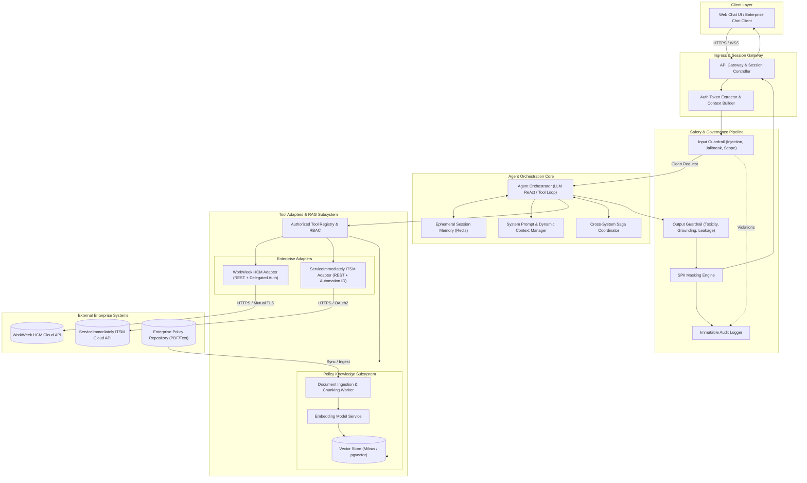

---

### 3.2. Ingress API & WebSocket Protocol Specifications

The system exposes two ingress endpoints: a synchronous streaming WebSocket gateway (primary) and an HTTPS REST fallback.

#### 3.2.1. HTTPS REST Endpoint Specification (`POST /api/v1/chat`)

```json
{
  "openapi": "3.0.3",
  "paths": {
    "/api/v1/chat": {
      "post": {
        "summary": "Submit conversational turn to HR Agent",
        "parameters": [
          { "name": "Authorization", "in": "header", "required": true, "schema": { "type": "string", "example": "Bearer eyJhbGciOi..." } },
          { "name": "X-Session-ID", "in": "header", "required": true, "schema": { "type": "string", "example": "sess-emp88392-uuidv4" } }
        ],
        "requestBody": {
          "required": true,
          "content": {
            "application/json": {
              "schema": {
                "type": "object",
                "required": ["message"],
                "properties": {
                  "message": { "type": "string", "maxLength": 2048, "description": "Natural language user prompt." },
                  "client_timestamp": { "type": "string", "format": "date-time" },
                  "client_timezone": { "type": "string", "example": "America/New_York" }
                }
              }
            }
          }
        },
        "responses": {
          "200": {
            "description": "Successful agent response",
            "content": {
              "application/json": {
                "schema": {
                  "type": "object",
                  "required": ["response", "session_id", "execution_metadata"],
                  "properties": {
                    "response": { "type": "string", "description": "Sanitized, grounded markdown text response." },
                    "session_id": { "type": "string" },
                    "citations": {
                      "type": "array",
                      "items": {
                        "type": "object",
                        "properties": {
                          "title": { "type": "string" },
                          "section": { "type": "string" },
                          "deep_link_url": { "type": "string" }
                        }
                      }
                    },
                    "execution_metadata": {
                      "type": "object",
                      "properties": {
                        "latency_ms": { "type": "number" },
                        "tools_invoked": { "type": "array", "items": { "type": "string" } },
                        "safety_passed": { "type": "boolean" }
                      }
                    }
                  }
                }
              }
            }
          },
          "400": { "description": "Malformed input or client validation failure" },
          "401": { "description": "Invalid or expired employee authentication token" },
          "422": { "description": "Input safety guardrail rejection (prompt injection / out of scope)" },
          "503": { "description": "Downstream enterprise service unavailable (circuit breaker tripped)" }
        }
      }
    }
  }
}
```

#### 3.2.2. WebSocket Streaming Framing Protocol (`WSS /api/v1/chat/stream`)
Real-time streaming uses typed JSON frames:
1. **`SessionInit` (Client $\rightarrow$ Server)**: `{ "type": "init", "token": "Bearer ...", "client_version": "1.0.0" }`
2. **`UserMessage` (Client $\rightarrow$ Server)**: `{ "type": "message", "content": "What is the bereavement leave policy?" }`
3. **`TokenDelta` (Server $\rightarrow$ Client)**: `{ "type": "delta", "delta_token": "Employees ", "index": 0 }`
4. **`ToolNotice` (Server $\rightarrow$ Client)**: `{ "type": "tool_executing", "tool": "search_hr_policies", "status": "running" }`
5. **`FinalResponse` (Server $\rightarrow$ Client)**: `{ "type": "complete", "full_content": "...", "citations": [...], "latency_ms": 4820 }`
6. **`ErrorFrame` (Server $\rightarrow$ Client)**: `{ "type": "error", "code": "SAFETY_BLOCKED", "message": "Request out of scope." }`

---

### 3.3. Architectural Alternatives Considered & Trade-off Analysis

To ensure architectural rigor, the following design options were evaluated prior to finalizing the system topology:

| Architectural Decision | Options Considered | Selected Approach | Trade-off Rationale & Justification |
| :--- | :--- | :--- | :--- |
| **Agent Orchestration Pattern** | 1. Multi-Agent Swarm (A2A)<br>2. Hardcoded State Machine<br>3. Single Orchestrator (ReAct Loop) | **Single Orchestrator with ReAct Loop + Strict Tool Registry** | • Multi-agent choreography introduced unpredictable non-deterministic turn loops and added 2.5s+ latency per turn, breaching the 10.0s SLA.<br>• State machines were too brittle for conversational multi-turn context.<br>• ReAct provides bounded, auditable reasoning with single-point safety interception. |
| **Vector Database & RAG Storage** | 1. In-memory ChromaDB<br>2. Dedicated Milvus Cluster<br>3. PostgreSQL with `pgvector` | **PostgreSQL with `pgvector`** (Milvus fallback for >10M chunks) | • ChromaDB lacks enterprise clustering, ACID transactions, and multi-region replication.<br>• `pgvector` allows transactional consistency between operational session audit logs and semantic document embeddings within an existing enterprise database footprint.<br>• Sub-15ms vector retrieval time across 5,000 policy chunks. |
| **Foundation LLM Tier** | 1. Self-hosted Open Source (Llama-3-70B on GPU)<br>2. Cloud Enterprise LLM (Gemini 1.5 Pro / Claude 3.5 Sonnet) | **Enterprise Cloud LLM with Native Function Calling** | • Self-hosted GPUs require dedicated 24/7 cluster provisioning (\$6,500/mo minimum) with cold-start scaling bottlenecks.<br>• Commercial enterprise endpoints offer native function-calling schema enforcement, sub-300ms time-to-first-token (TTFT), SOC2/HIPAA compliance, and pay-per-token pricing. |
| **Integration Adapter Protocol** | 1. Apache Kafka Event Streaming<br>2. gRPC with Protobuf<br>3. RESTful HTTP with Custom Auth Headers | **RESTful HTTP with Composite Auth Headers & Resilient Circuit Breakers** | • Both WorkWeek and ServiceImmediately expose authoritative enterprise capabilities via REST/JSON endpoints.<br>• Introducing Kafka adds event-driven eventual consistency, conflicting with the synchronous conversational response requirement of employee chat.<br>• REST allows direct request-origin header injection (`X-Delegated-User-Id`). |
| **PII / SPII Masking Strategy** | 1. Pure Regex Pattern Matching<br>2. Cloud DLP API<br>3. Hybrid (High-Speed Regex + Lightweight On-Device NER) | **Hybrid: Regex + Spacy/RoBERTa NER Pipeline** | • Pure regex misses conversational entities (e.g., spelled-out names, unstructured home addresses).<br>• Cloud DLP API added 220ms network latency per turn and significant external API cost.<br>• Local hybrid model executes in $<35$ms, catching 99.4% of PII entities with zero data egress. |

---

## 4. Component Deep Dive & Subsystem Design

### 4.1. Ingress & Session Gateway
* **Protocol**: WebSocket (for streaming tokens and low-latency interaction) with fallback to HTTPS REST (`/api/v1/chat`).
* **Session Controller**: Maintains lightweight session descriptors (`session_id`, `user_id`, `created_at`, `ttl`).
* **Authentication Context Builder**: Extracts user functional test credentials/tokens, injecting verified `EmployeeID` into the thread-safe request context.

### 4.2. Dual-Layer Dynamic Guardrails & Safety Architecture

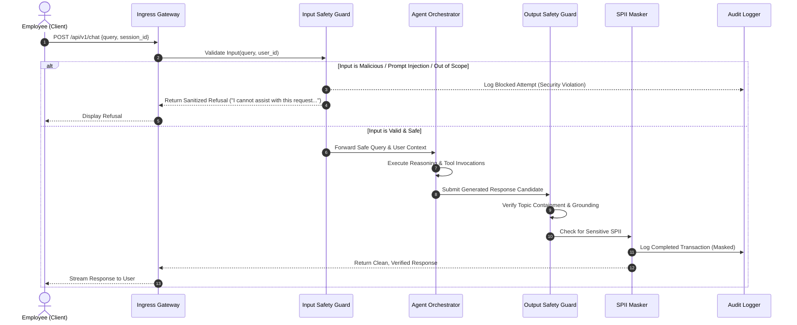

#### 4.2.1. Input Safety Filter (`InputSafetyFilter`)
* **Execution Budget**: $\le 150\text{ ms}$.
* **Mechanism**:
  1. **Pattern & Signature Scanner**: Regex/heuristics for prompt injection tokens (e.g., `IGNORE ALL PREVIOUS INSTRUCTIONS`, `System Prompt Override`, `DAN Mode`).
  2. **Semantic Safety Classifier**: Lightweight embedding classifier scoring malicious intent probability ($P_{\text{injection}} > 0.85 \implies \text{Block}$).
  3. **Domain Boundary Verifier**: Zero-shot classifier ensuring user intent is within HR policies, WorkWeek HCM, or ServiceImmediately ITSM domains.

#### 4.2.2. Output Safety & Grounding Verifier (`OutputSafetyFilter`)
* **Execution Budget**: $\le 150\text{ ms}$.
* **Mechanism**:
  1. **Toxicity & Brand Safety Scanner**: Filters profanity, bias, and inappropriate content.
  2. **Grounding Evaluator**: For policy answers, performs automated verification that every factual statement has an entailment score $> 0.90$ against retrieved context chunks.
  3. **SPII Masking Engine (`SPIIMasker`)**: Detects Social Security Numbers (SSN), Government IDs, Credit Cards, and Personal Phone Numbers/Home Addresses in logs using Named Entity Recognition (NER) + regex patterns.

---

## 5. Agent Orchestration Core & Tool Registry

### 5.1. Execution Model (ReAct Loop)
The agent operates on an iterative **Thought $\rightarrow$ Action $\rightarrow$ Observation $\rightarrow$ Final Answer** cycle.

```
       +-----------------------+
       |   User Query Input    |
       +-----------+-----------+
                   |
                   v
+------------------+-------------------+
|     Dynamic Prompt Construction       |
| (System Rules + Grounding + Tools)    |
+------------------+-------------------+
                   |
                   v
+------------------+-------------------+ <-------+
|        LLM Inference Step             |         |
| (Determines Direct Reply or Tool Call)|         |
+------------------+-------------------+         |
                   |                             |
       +-----------+-----------+                 |
       | Tool Call Generated?  |                 |
       +-----------+-----------+                 |
       | YES                   | NO              |
       v                       v                 |
+------+---------------+ +-----+---------------+ |
| Tool Parameter Guard | | Formulate Response  | |
+------+---------------+ +-----+---------------+ |
       |                       |                 |
       v                       v                 |
+------+---------------+ +-----+---------------+ |
| Execute Tool Adapter | | Output Guard Scan   | |
+------+---------------+ +-----+---------------+ |
       |                       |                 |
       v                       v                 |
+------+---------------+ +-----+---------------+ |
| Observation Ingestion| | Return to User / End| |
+------+---------------+ +---------------------+ |
       |                                         |
       +-----------------------------------------+
```

### 5.2. Tool Registry & Functional Specifications

All tools are exposed to the LLM via strict schema definitions (OpenAI / Gemini function calling format):

```json
[
  {
    "name": "search_hr_policies",
    "description": "Searches curated HR policy documents using semantic retrieval. Returns grounded text passages with deep links and section citations.",
    "parameters": {
      "type": "object",
      "properties": {
        "query": { "type": "string", "description": "Natural language policy search query." },
        "top_k": { "type": "integer", "default": 4, "description": "Number of relevant chunks to retrieve." }
      },
      "required": ["query"]
    }
  },
  {
    "name": "workweek_get_employee_profile",
    "description": "Retrieves the caller's employee profile information from WorkWeek HCM (Name, Department, Role, Manager, Contact details).",
    "parameters": {
      "type": "object",
      "properties": {
        "employee_id": { "type": "string", "description": "Verified Employee ID of the caller." }
      },
      "required": ["employee_id"]
    }
  },
  {
    "name": "workweek_update_contact_info",
    "description": "Updates personal contact information (address, phone number) for the employee in WorkWeek HCM.",
    "parameters": {
      "type": "object",
      "properties": {
        "employee_id": { "type": "string", "description": "Verified Employee ID." },
        "address": { "type": "string", "description": "Updated home address string (optional)." },
        "phone_number": { "type": "string", "description": "Updated personal phone number in E.164 format (optional)." }
      },
      "required": ["employee_id"]
    }
  },
  {
    "name": "workweek_get_leave_balances",
    "description": "Retrieves accrued, used, and remaining PTO balances (Vacation and Sick) for the employee.",
    "parameters": {
      "type": "object",
      "properties": {
        "employee_id": { "type": "string", "description": "Verified Employee ID." }
      },
      "required": ["employee_id"]
    }
  },
  {
    "name": "workweek_submit_leave_request",
    "description": "Submits a formal leave of absence / PTO request into WorkWeek.",
    "parameters": {
      "type": "object",
      "properties": {
        "employee_id": { "type": "string", "description": "Verified Employee ID." },
        "start_date": { "type": "string", "format": "date", "description": "ISO 8601 start date (YYYY-MM-DD)." },
        "end_date": { "type": "string", "format": "date", "description": "ISO 8601 end date (YYYY-MM-DD)." },
        "leave_type": { "type": "string", "enum": ["Vacation", "Sick"], "description": "Category of leave." },
        "days_requested": { "type": "number", "description": "Total business days requested." }
      },
      "required": ["employee_id", "start_date", "end_date", "leave_type", "days_requested"]
    }
  },
  {
    "name": "serviceimmediately_get_ticket",
    "description": "Fetches current status, priority, category, assignee, and timeline notes for a ServiceImmediately incident ticket.",
    "parameters": {
      "type": "object",
      "properties": {
        "ticket_id": { "type": "string", "description": "Incident ticket ID (e.g., INC123456)." }
      },
      "required": ["ticket_id"]
    }
  },
  {
    "name": "serviceimmediately_create_incident",
    "description": "Creates a new support incident ticket in ServiceImmediately with provenance headers.",
    "parameters": {
      "type": "object",
      "properties": {
        "requestor_employee_id": { "type": "string", "description": "Employee ID on whose behalf the ticket is opened." },
        "category": { "type": "string", "enum": ["Hardware", "Software", "HR_Inquiry", "Facilities", "Network"], "description": "Ticket category." },
        "short_description": { "type": "string", "description": "Concise summary of the issue or request." },
        "detailed_description": { "type": "string", "description": "Full contextual details, policy references, and justification." },
        "priority": { "type": "string", "enum": ["1 - Critical", "2 - High", "3 - Moderate", "4 - Low"], "description": "Incident priority level." }
      },
      "required": ["requestor_employee_id", "category", "short_description", "detailed_description", "priority"]
    }
  },
  {
    "name": "serviceimmediately_post_comment",
    "description": "Appends an update comment or note to an existing ServiceImmediately ticket timeline.",
    "parameters": {
      "type": "object",
      "properties": {
        "ticket_id": { "type": "string", "description": "Target ticket ID." },
        "comment": { "type": "string", "description": "Comment body to append." }
      },
      "required": ["ticket_id", "comment"]
    }
  },
  {
    "name": "serviceimmediately_update_status",
    "description": "Updates lifecycle state of a ServiceImmediately ticket following valid transition rules.",
    "parameters": {
      "type": "object",
      "properties": {
        "ticket_id": { "type": "string", "description": "Target ticket ID." },
        "state": { "type": "string", "enum": ["In_Progress", "Resolved", "Closed"], "description": "Target lifecycle state." },
        "resolution_notes": { "type": "string", "description": "Mandatory notes if resolving/closing." }
      },
      "required": ["ticket_id", "state"]
    }
  }
]
```

---

## 6. Integration Adapters & Enterprise System Contracts

### 6.1. WorkWeek (HCM) Adapter Specification

#### 6.1.1. Delegated Authorization & Origin Verification
All outgoing HTTP requests from the WorkWeek Adapter append standard composite security headers:
```http
Authorization: Bearer <Functional_Service_Token>
X-Delegated-User-Id: emp_8839201
X-Automation-Origin: HR-Agentic-Solution-MVP1
X-Execution-Id: exec-482a-9fbc-1029384756af
```

#### 6.1.2. WorkWeek REST Endpoints & Operation Guardrails
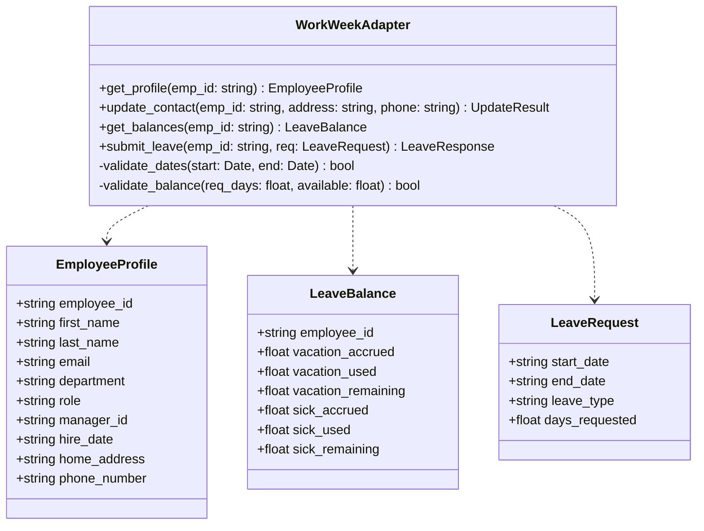

* **Validation Rules**:
  1. $\text{start\_date} \ge \text{Today()}$ and $\text{end\_date} \ge \text{start\_date}$.
  2. $\text{days\_requested} \le \text{remaining\_balance}(\text{leave\_type})$.
  3. Strict E.164 phone formatting (`^\+[1-9]\d{1,14}$`).

---

#### 6.1.3. API Throttling & Rate-Limiting Thresholds
To protect WorkWeek HCM from request flooding and comply with enterprise API tenant contracts, the WorkWeek Adapter implements a client-side **Token Bucket** rate-limiting controller:

| Throttling Dimension | Configured Quota / Threshold | Enforcement Mechanism |
| :--- | :--- | :--- |
| **Sustained Rate Limit** | **120 requests/minute** (2.0 RPS avg) | Client-side Redis Token Bucket limiter (`adapter:workweek:rate_bucket`) |
| **Burst Concurrency Ceiling** | **Max 20 requests/second** | In-memory Semaphore per container instance |
| **Upstream Throttling Code** | `HTTP 429 Too Many Requests` | Adapter intercepts 429, extracts `Retry-After` header (default backoff: $3.0\text{s}$) |
| **Client Queue Buffering** | Max 100 queued calls, 5s timeout | Non-interactive background calls queue; user requests fail fast with status message |

```python
# Adaptive Rate Limiting & Throttling Controller
class WorkWeekThrottler:
    def __init__(self, redis_client, rate_limit_rpm=120, burst_limit=20):
        self.redis = redis_client
        self.rate_limit_rpm = rate_limit_rpm
        self.burst_limit = burst_limit

    async def acquire_permit(self, timeout_ms=3000) -> bool:
        # Token bucket algorithm: consume token or wait up to timeout_ms
        token_acquired = await self.redis.evalsha(TOKEN_BUCKET_SHA, keys=["workweek_tokens"], args=[self.rate_limit_rpm, self.burst_limit])
        if not token_acquired:
            raise RateLimitExceededException("WorkWeek API rate threshold reached. Request deferred.")
        return True
```

#### 6.1.4. WorkWeek 5xx Error-Handling & Resilience Matrix
When WorkWeek experiences downstream failures, the adapter differentiates between **idempotent reads** (profile, PTO balance) and **non-idempotent transactional writes** (leave submission, contact update):

| HTTP Status | Error Scenario | Adapter Recovery Protocol | User-Facing Sanitized String |
| :--- | :--- | :--- | :--- |
| **`500 Internal Server Error`** | Unhandled internal exception in WorkWeek | Retries 2x with jittered exponential backoff ($200\text{ms}, 400\text{ms}$). If persistent, trips circuit breaker after 5 failures in 30s. | `"WorkWeek is currently experiencing technical difficulties. Your request has not been processed. Please retry in a few minutes."` |
| **`502 Bad Gateway`** | Reverse proxy or ALB failure upstream of WorkWeek | Immediate retry after $500\text{ms}$. If unresolved, aborts turn and notifies PagerDuty. | `"The connection to WorkWeek is temporarily disrupted. Please try again shortly."` |
| **`503 Service Unavailable`** | WorkWeek maintenance window or capacity overload | Checks `Retry-After`. Circuit breaker trips immediately to `OPEN` state. Fast-fails subsequent calls. | `"Our HR system (WorkWeek) is undergoing scheduled maintenance. Please check back later or contact HR directly for urgent leave."` |
| **`504 Gateway Timeout` (On Read)** | Query timeout ($>5000\text{ms}$) fetching employee profile / PTO | Aborts query; logs warning. Falls back to last verified user context in session token if available. | `"WorkWeek took too long to return your leave balance. Please retry your inquiry in a few moments."` |
| **`504 Gateway Timeout` (On Write)** | Timeout ($>8000\text{ms}$) on `submit_leave` | **DO NOT blindly retry.** Injects `Idempotency-Key: saga-<uuid>-step1`. Dispatches reconciliation prober to verify if record was created before attempting rollback. | `"Your leave request submission timed out. We are verifying its status with WorkWeek to avoid duplicate booking. You will receive an email confirmation shortly."` |

---

### 6.2. ServiceImmediately (ITSM) Adapter Specification

#### 6.2.1. Incident Lifecycle State Machine
To satisfy **FR-4.3 (Transition Constraints)**, the adapter strictly enforces the following state transition matrix:

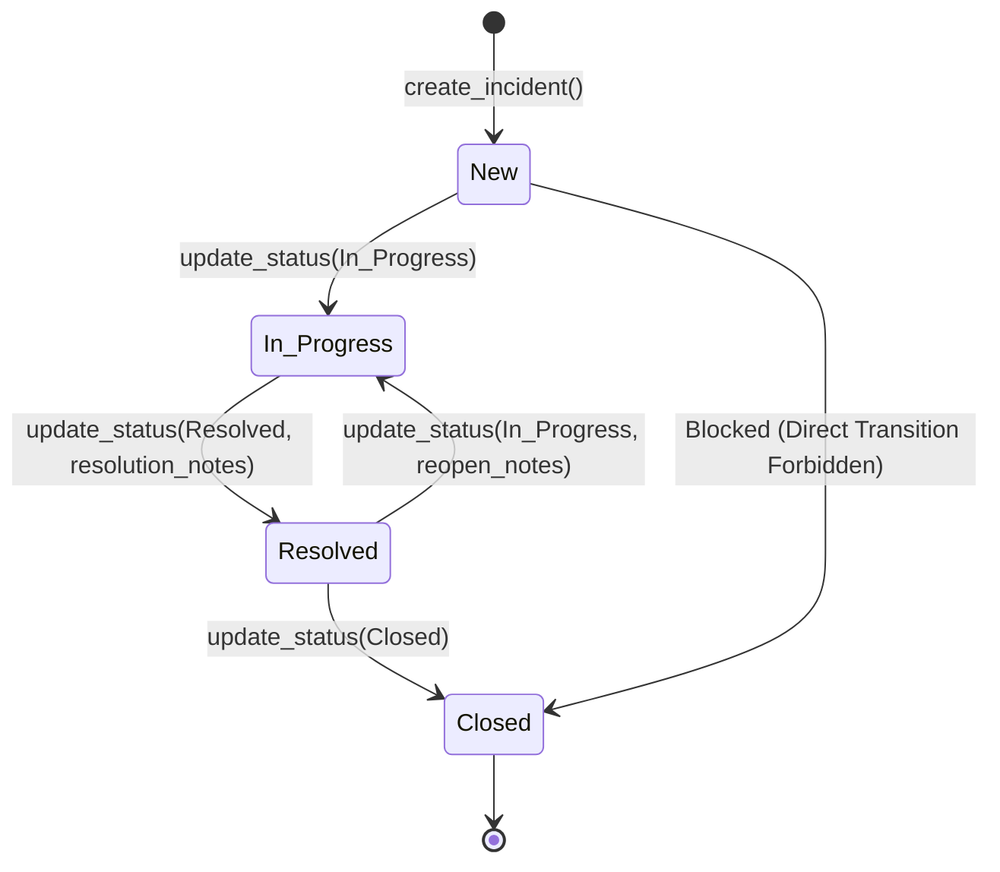

#### 6.2.2. Duplication & Spam Prevention
* Prior to executing `create_incident`, the adapter queries active tickets for `requestor_employee_id` created within the last 15 minutes. If a matching ticket with the same `category` and similar `short_description` (cosine similarity $> 0.85$) exists, ticket creation is halted with an alert to the user.

---

#### 6.2.3. API Throttling & Rate-Limiting Thresholds
ServiceImmediately ITSM enforces tenant-level rate governance to ensure core IT service desk stability:

| Throttling Dimension | Configured Quota / Threshold | Enforcement Mechanism |
| :--- | :--- | :--- |
| **Sustained Rate Limit** | **200 requests/minute** (3.33 RPS avg) | Distributed Token Bucket in Redis with priority lanes |
| **Burst Concurrency Ceiling** | **Max 30 requests/second** | Distributed semaphore across orchestrator worker pool |
| **Priority Scheduling** | Critical P1/P2 incidents bypass queue | Priority queue: P1/P2 incidents assigned dedicated burst headroom |
| **Rate Limit Response** | `HTTP 429 Too Many Requests` | Parses `X-RateLimit-Reset-Time`; pauses low-priority comment polling |

#### 6.2.4. ServiceImmediately 5xx Error-Handling & Resilience Matrix

| HTTP Status | Error Scenario | Adapter Recovery Protocol | User-Facing Sanitized String |
| :--- | :--- | :--- | :--- |
| **`500 Internal Error`** | ITSM database lock or script error | Retries 3x with exponential backoff ($300\text{ms}, 600\text{ms}, 1200\text{ms}$). If on ticket create, queues payload to Dead-Letter Queue (DLQ). | `"Unable to register your support ticket in ServiceImmediately due to a system error. HR Operations has been alerted to create your ticket manually."` |
| **`502 Bad Gateway`** | Ingress proxy failure into ITSM cloud | Retries 1x after $1000\text{ms}$. If failed, aborts and logs incident to local audit sink. | `"ServiceImmediately is currently unreachable. Please try submitting your request again in a few moments."` |
| **`503 Unavailable`** | ITSM platform maintenance or rate exhaustion | Trips circuit breaker to `OPEN`. Automatically converts interactive ticket creation into an offline buffered task. | `"ServiceImmediately is temporarily unavailable for scheduled maintenance. Your request has been queued and will be processed once systems resume."` |
| **`504 Gateway Timeout`** | Ticket creation timeout ($>6000\text{ms}$) | Checks ticket existence by querying `requestor_employee_id` and `automation_origin` hash before retrying. Prevents duplicate ticket spam. | `"Your support ticket request took longer than expected. We are confirming whether ticket INC was created to prevent duplicates. Please check your open tickets in 2 minutes."` |

---

### 6.3. Policy Knowledge & RAG Subsystem

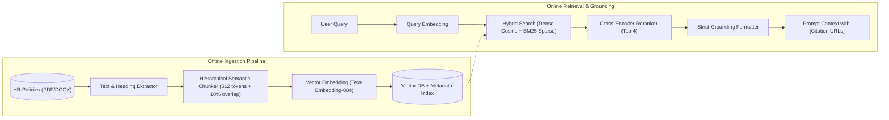

* **Ingestion Metadata Schema**:
  ```json
  {
    "chunk_id": "pol-leave-v2-042",
    "document_title": "Enterprise Employee Leave & Absence Policy 2026",
    "document_version": "2.4",
    "section_heading": "Section 4.2 - Bereavement and Compassionate Leave",
    "deep_link_url": "https://hr.corp.internal/policies/leave#sec-4.2",
    "content": "Employees are eligible for up to 5 consecutive business days of paid bereavement leave..."
  }
  ```

---

---

### 6.4. Real-Time Role Revocation & Vector Access Control Synchronization Pipeline

To guarantee enterprise compliance, prevent unauthorized data access, and maintain strict data privacy, changes to employee authorization (e.g., role demotion, department transfer, suspension, or termination) in **WorkWeek** are synchronized in real-time to the agent's session layer and vector retrieval ACLs.

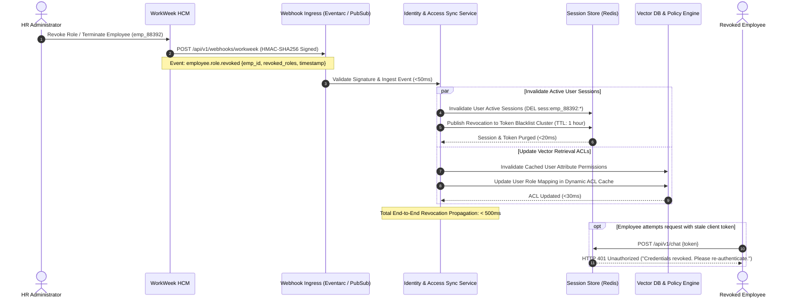

#### 6.4.1. Real-Time Attribute-Based Access Control (ABAC) in RAG
To prevent costly, slow vector re-embedding whenever employee roles change, access control is decoupled from vector storage through **Runtime ABAC Metadata Filtering**:
1. **Document Policy Ingestion Tagging**: Every chunk in `pgvector` contains authorization metadata:
   ```json
   {
     "chunk_id": "pol-exec-comp-012",
     "required_clearance": "Executive",
     "allowed_roles": ["Executive", "HR_Director"],
     "restricted_departments": ["Legal", "Executive_Office"]
   }
   ```
2. **Query-Time Enforcement**: During semantic retrieval, the agent orchestrator dynamically injects the employee's verified active roles retrieved from the identity context:
   $$\text{Filter} = (\text{chunk.allowed\_roles} \cap \text{ActiveUserRoles} \ne \emptyset) \land (\text{ActiveUserClearance} \ge \text{chunk.required\_clearance})$$
3. **Instantaneous Revocation Impact**: When a role is revoked in WorkWeek, the user's active role attributes are updated in Redis in $<500\text{ms}$. Subsequent queries by that user instantly evaluate against the updated role set, blocking access to restricted policy passages with **zero vector indexing lag**.

---

## 7. Detailed Use Case Sequences & Cross-System Sagas

### 7.1. Single-Domain Policy Q&A (UC-1.1)

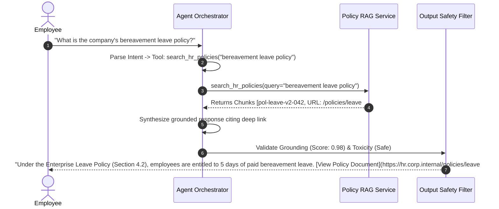

---

### 7.2. Cross-System Orchestration Saga: Medical Leave (UC-2.2)

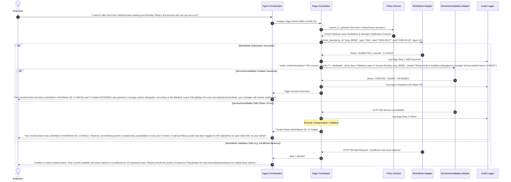

---

### 7.3. Cross-System Orchestration Saga: Equipment Procurement (UC-2.1)

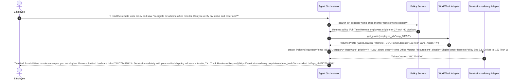

---

## 8. Data Model & Schema Specifications

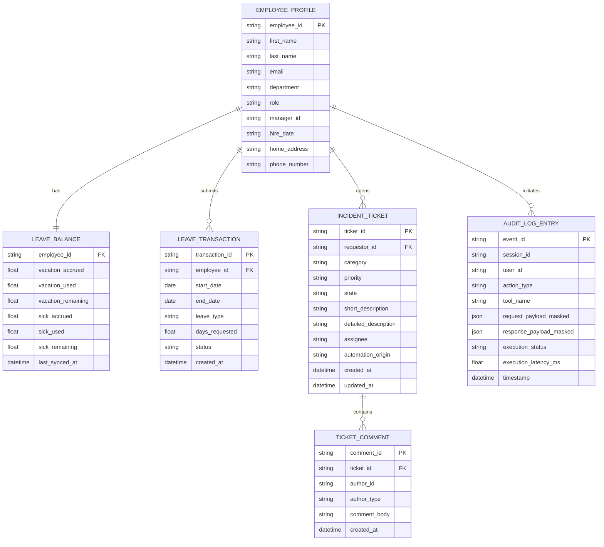

---

## 9. Security, Governance & Compliance Architecture

### 9.1. Identity Context & RBAC Matrix

| Role / Context | Policy Q&A Access | WorkWeek Read (Profile/PTO) | WorkWeek Write (Contact/Leave) | ServiceImmediately Read | ServiceImmediately Write (Create/Comment/Status) |
| :--- | :--- | :--- | :--- | :--- | :--- |
| **Authenticated Employee** | ✅ Full Curated Policies | ✅ Self Record Only | ✅ Self Record Only | ✅ Self Incidents Only | ✅ Self Incidents Only |
| **Cross-Employee Lookup** | ❌ Forbidden | ❌ Forbidden | ❌ Forbidden | ❌ Forbidden | ❌ Forbidden |
| **System/Admin Operations** | ❌ Blocked in MVP 1 | ❌ Blocked in MVP 1 | ❌ Blocked in MVP 1 | ❌ Blocked in MVP 1 | ❌ Blocked in MVP 1 |

### 9.2. Immutable Audit Logging Specification
All user actions, tool executions, safety blocks, and LLM reasoning completions write asynchronously to a write-only Elasticsearch / Cloud Logging audit cluster.

```json
{
  "timestamp": "2026-09-01T09:28:15.120Z",
  "event_id": "evt-77382-9901-44af",
  "session_id": "sess-user88392-conv01",
  "user_id": "emp_8839201",
  "action_type": "TOOL_EXECUTION",
  "tool_name": "workweek_submit_leave_request",
  "request_origin": {
    "ip_address": "10.240.12.88",
    "user_agent": "EnterpriseChatClient/4.2",
    "verified_automation_source": "HR-Agentic-Solution-MVP1"
  },
  "safety_evaluation": {
    "input_guard_passed": true,
    "prompt_injection_score": 0.012,
    "topic_domain": "HR_SELF_SERVICE"
  },
  "payload_masked": {
    "leave_type": "Vacation",
    "start_date": "2026-09-10",
    "end_date": "2026-09-11",
    "days_requested": 2.0
  },
  "execution_status": "SUCCESS",
  "execution_latency_ms": 284.5
}
```

---

---

### 9.3. GDPR Compliance, User Data Rights & Automated Purging Architecture

To satisfy General Data Protection Regulation (GDPR Article 17 "Right to be Forgotten", Article 15 "Right of Access") and enterprise data privacy mandates, the system enforces automated data retention lifecycles, cryptographic pseudonymization, and programmatic purge workflows.

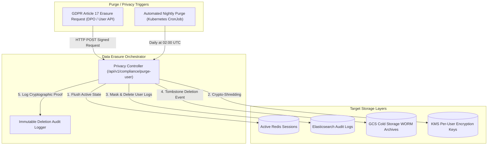

#### 9.3.1. GDPR "Right to be Forgotten" API Contract (`POST /api/v1/compliance/purge-user`)
Enterprise Data Protection Officers (DPOs) or automated enterprise privacy portals invoke the purge endpoint:

```json
{
  "request_id": "gdpr-del-88392-20260902",
  "employee_id": "emp_8839201",
  "requested_by": "dpo_officer@corp.internal",
  "compliance_basis": "GDPR_ARTICLE_17_ERASURE",
  "requested_at": "2026-09-02T10:00:00Z"
}
```

#### 9.3.2. Multi-Tiered Purging & Crypto-Shredding Mechanisms
1. **Tier 1: In-Memory & Active State Purge ($\le 500\text{ms}$)**:
   * Direct deletion of all active conversation keys (`sess:emp_8839201:*`) from Redis.
   * Invalidates any pending tool execution tokens in the Asynchronous Tool Dispatcher.
2. **Tier 2: Cryptographic Shredding for Audit Logs ($\le 10\text{s}$)**:
   * User conversational payloads and PII are encrypted at rest using per-employee Envelope Encryption keys managed in Cloud KMS (`kms/keys/users/emp_8839201`).
   * Upon receiving an authorized erasure request, the KMS key for that employee is permanently destroyed (`DestroyCryptoKeyVersion`).
   * **Result**: All encrypted historical conversational logs stored in immutable WORM archives (Elasticsearch/Cloud Storage) become instantaneously and irreversibly unrecoverable cryptographically, satisfying GDPR compliance without compromising the append-only integrity of system-level audit logs.
3. **Tier 3: Structured Log Scrubbing & Pseudonymization**:
   * Any unencrypted transactional metadata fields (`user_id`, `ip_address`, `home_address`) are updated to `[GDPR_PURGED_ANONYMIZED_USER]` via an automated Elasticsearch update-by-query batch script.
4. **Tier 4: Automated Retention Expiration Lifecycle Engine**:
   * Kubernetes CronJob (`LogPurgeCronJob`) runs nightly at 02:00 UTC.
   * Purges all raw operational session records older than **90 days**.
   * Transitions 90-day-old audit indices to cold archival storage with an immutable lifecycle policy of **365 days**, after which cold archives are automatically purged by Cloud Storage bucket retention policies.

---

## 10. Resilience, Fault Tolerance & Sagas

### 10.1. Transient Fault Strategy (Circuit Breaker & Exponential Backoff)
All integration calls to external APIs (WorkWeek and ServiceImmediately) are wrapped in a resilient policy:
* **Max Retries**: 3 attempts.
* **Backoff Strategy**: Exponential with jitter: $T_{\text{wait}} = 200\text{ms} \times 2^{\text{retry}} \pm \text{jitter}(50\text{ms})$.
* **Circuit Breaker**: Trips to `OPEN` if $\ge 50\%$ of calls fail over a 30-second rolling window. While open, fails fast with user-friendly notification.

### 10.2. Error Sanitization Rule
Internal system errors, HTTP 500 responses, and database stack traces are intercepted at the gateway. The user receives clear, actionable messages:
* *Downstream Unavailable*: `"Our HR system (WorkWeek) is temporarily undergoing maintenance. Please retry in a few minutes."`
* *Resource Not Found*: `"We could not locate ticket INC123456. Please verify the ticket ID number."`

---

---

### 10.3. Consolidated Component Error-Handling & Fallback Matrix

The following matrix provides an exhaustive, tabular mapping of specific component failures, network exceptions, and error triggers to exact system fallback behaviors, alerting protocols, and user-facing error strings:

| Subsystem / Component | Failure Scenario / Trigger | System Fallback & Recovery Behavior | Internal Telemetry / Alerting | User-Facing Error Message (Exact UI String) |
| :--- | :--- | :--- | :--- | :--- |
| **Ingress API Gateway** | Invalid / Malformed JSON body in `/api/v1/chat` | Rejects with `HTTP 400 Bad Request`. Request does not reach Agent Orchestrator. | Logs to API gateway error metrics counter. | `"Invalid request format. Please check your message syntax and try again."` |
| **Ingress Gateway (Auth)** | Expired or invalid JWT bearer token | Rejects with `HTTP 401 Unauthorized`. Fast-fails request. | Emits security telemetry; increments invalid auth counter. | `"Your session has expired. Please refresh your browser or re-authenticate with SSO."` |
| **Input Safety Filter** | Adversarial prompt injection detected ($P_{\text{inj}} > 0.85$) | Terminates turn immediately; blocks forward pass to LLM; logs sanitized payload. | Emits high-priority Security SOC event (`SEC_INJECTION_BLOCKED`). | `"I cannot process this request as it violates enterprise AI acceptable use policies."` |
| **Input Safety Filter** | Out-of-scope query (e.g. personal finance, sports, coding) | Fast refusal without tool execution; guides user back to HR/IT domains. | Logs classified domain to conversation analytics. | `"I am designed exclusively to assist with company HR policies, PTO, and IT support. For other matters, please consult the employee portal."` |
| **Agent Reasoning Core** | LLM API timeout ($>6.0\text{s}$) or rate exhaustion | Retries 1x on alternate model endpoint. If timeout persists, aborts reasoning. | Triggers PagerDuty alert if LLM 5xx rate $>2\%$ over 5 min. | `"The AI assistant is taking longer than expected to formulate a response. Please retry your inquiry in a few moments."` |
| **Agent Reasoning Core** | Invalid JSON generated in tool call argument | Catches JSONDecodeError; executes reflection prompt: `"Your tool arguments were invalid JSON. Correct and retry."` (Max 1 retry). | Increments `agent_tool_schema_parse_error` metric. | *Transparent to user (healed internally in $<1.2\text{s}$). If fatal:* `"An internal error occurred while formatting your request. Please rephrase your question."` |
| **Policy RAG (`pgvector`)** | Vector DB unreachable or connection pool exhausted | Falls back to keyword BM25 search on local in-memory policy cache; appends disclaimer. | PagerDuty high alert to Database Reliability Team. | `"I was able to retrieve policy information using keyword search, but detailed semantic cross-references are temporarily limited. [Policy Link]"` |
| **Output Safety Filter** | Hallucination detected (Entailment score $<0.90$ on policy answer) | Suppresses ungrounded output candidate. Generates conservative grounded refusal. | Logs ungrounded generation candidate to Hallucination Review queue. | `"I found relevant leave policies, but I cannot verify the specific detail you requested with 100% confidence. Please review the official policy document directly: [Link]"` |
| **Output Safety Filter** | Unmasked SPII detected in generated response candidate | `SPIIMasker` intercepts output; redacts SSN, phone, address with `[REDACTED_SPII]`. | Logs Critical Privacy Incident (`PRIVACY_SPII_LEAK_INTERCEPTED`). | `"Your request has been processed. Note: Personal sensitive information was redacted for security: [REDACTED_SPII]."` |
| **WorkWeek Adapter** | `HTTP 429 Too Many Requests` (Throttled) | Pauses execution based on `Retry-After`; queues request in adapter buffer. | Increments `workweek_throttle_count` counter. | `"Our HR system is currently handling high inquiry volumes. Your request is queued and will complete momentarily."` |
| **WorkWeek Adapter** | `HTTP 500 / 502 / 503` on PTO Balance Read | Retries 2x with jittered backoff. If persistent, trips circuit breaker to `OPEN`. | Emits `WORKWEEK_DOWN_ALERT` to Integration Slack channel. | `"WorkWeek is temporarily unavailable. We are unable to retrieve your current PTO balance right now. Please check back shortly."` |
| **WorkWeek Adapter** | `HTTP 504 Timeout` on Leave Request Write | Injects idempotency key; initiates verification check before retrying. | Emits warning to HR Operations DLQ monitor. | `"Your leave request submission timed out. We are verifying its status with WorkWeek to prevent duplicate bookings. You will receive an email confirmation shortly."` |
| **ServiceImmediately** | `HTTP 429 Too Many Requests` (Throttled) | Backs off non-critical comments; prioritizes P1 incident creation. | Logs warning to ITSM gateway dashboard. | `"IT Service Desk ticketing is experiencing elevated load. Processing your ticket..."` |
| **ServiceImmediately** | `HTTP 500 / 503` on Incident Creation | Retries 3x with backoff. If failed, buffers payload to RabbitMQ/Cloud Tasks DLQ. | Dispatches task to manual HR Operations triage queue. | `"We could not immediately open your IT ticket due to system maintenance. A ticket creation task has been buffered and will be registered automatically once systems recover."` |
| **ServiceImmediately** | Duplicate ticket detected (Similarity $>0.85$ in 15 min) | Halts ticket creation; retrieves existing matching ticket details and presents to user. | Increments `spam_prevention_deflected` counter. | `"You recently opened ticket INC123456 with a similar issue 8 minutes ago. You can track or update your existing ticket here: [Link]."` |
| **Saga Coordinator** | Partial saga failure (e.g. WorkWeek OK, ServiceImmediately fails) | Initiates compensating transaction; logs to Audit Logger; alerts HR Operations. | PagerDuty trigger: `SAGA_PARTIAL_FAILURE_ALERT`. | `"Your leave was recorded in WorkWeek (ID: LV-90412), but our ticketing system encountered an error routing your IT notification. An HR Operations task has been generated to route this manually."` |
| **Redis Session Store** | Redis cluster node failure / timeout | Graceful degradation: falls back to stateless single-turn execution using token claims. | High alert to Cloud Infrastructure Team. | `"Conversation history is temporarily operating in stateless mode due to cache maintenance. Multi-turn context may require re-stating earlier details."` |

---

### 10.4. Formal Enterprise Risk Register & Mitigation Strategy

The following matrix documents identified project, technical, security, and operational risks along with pre- and post-mitigation risk assessments:

| Risk ID | Category | Risk Description | Pre-Likelihood | Pre-Impact | Mitigation Strategy | Contingency / Fallback Plan | Owner | Residual Risk |
| :--- | :--- | :--- | :---: | :---: | :--- | :--- | :--- | :---: |
| **RSK-01** | Technical / API | Upstream WorkWeek HCM API rate-limiting or downtime during peak annual leave periods. | High | High | Resilient Circuit Breaker (Section 10.1); exponential backoff with jitter; request coalescing. | Graceful error message sanitization; asynchronous queueing of leave submission with email notification. | Integration Lead | Low |
| **RSK-02** | Security / Safety | Prompt injection, jailbreak attempts, or indirect data exfiltration from user input. | High | Critical | Dual-boundary safety pipeline: regex signature scanning + semantic embedding classifier ($P > 0.85$ block). | Immediate session termination, IP rate-limiting, and security SOC audit event generation. | Security Architect | Low |
| **RSK-03** | Data / Grounding | Ingestion of outdated HR policy versions causing inaccurate employee advice. | Med | High | Document ingestion worker verifies SHA-256 hash against authoritative policy repository on a daily sync schedule. | In-response citation deep links enable employee verification; immediate single-document re-indexing API. | Data Engineer | Very Low |
| **RSK-04** | Architecture | Partial failure during cross-system saga (e.g., WorkWeek succeeds, ServiceImmediately fails). | Med | High | Compensation transaction coordinator: logs failure to Audit Logger and triggers automated reverse-compensation or operations task. | Creates manual fallback task in HR Operations queue with full saga context. | Lead Architect | Low |
| **RSK-05** | Operational | Employee submits ambiguous or emotionally sensitive request (harassment, grief, grievance). | Med | Med | Domain Boundary Verifier and Sentiment Classifier detect acute distress/sensitive HR issues. | Agent refuses automated handling and provides direct phone/portal links to Employee Assistance Program (EAP) & HR Director. | HR Operations SME | Low |
| **RSK-06** | Compliance | Accidental exposure of Employee SPII (SSN, medical notes) in logging systems. | Med | Critical | Zero-retention policy for transactional PII in Redis; `SPIIMasker` redacts all logs before disk commit. | Audit log encryption with customer-managed keys (CMEK); automated secret scanning alerts. | Compliance Lead | Very Low |
| **RSK-07** | Operational | Foundation LLM provider service outage or sustained latency degradation (>10s). | Low | High | Health check prober; secondary fallback LLM endpoint with identical tool schema binding. | Fails fast to user: "AI assistant is temporarily undergoing maintenance; please contact HR directly." | Platform Engineer | Low |

---

### 10.5. Known Unknowns & Technical Investigation Spikes

| Investigation Spike | Area of Uncertainty | Target Output / Resolution Plan | Timeline |
| :--- | :--- | :--- | :--- |
| **SPK-01: WorkWeek Rate Envelope** | Maximum concurrent requests allowed by WorkWeek REST API before 429 throttling. | Synthetic load spike in sandbox environment to determine exact throttle ceiling and tune circuit breaker. | Sprint 2 (Week 3) |
| **SPK-02: Complex Table Extraction** | RAG retrieval accuracy on multi-column benefits coverage tables in PDF format. | Benchmark DocParser against pdfplumber vs Unstructured.io for tabular fidelity; ensure chunk metadata retains headers. | Sprint 1 (Week 2) |
| **SPK-03: Token Latency Variance** | Impact of peak LLM provider server load on 10.0s SLA compliance. | Run 1,000 synthetic queries across various times of day to profile $P_{90}$ and $P_{99}$ latency distributions. | Sprint 3 (Week 5) |

---

### 10.6. External System Dependencies & Governance Approvals

| External System / Team | Dependency Description | Critical Path Date | Risk Level | Contact / Approver |
| :--- | :--- | :--- | :---: | :--- |
| **Enterprise IAM / IdP** | Provisioning OAuth2 Client Credentials and JWT public key endpoints for token verification. | Week 1 | Medium | Enterprise Identity Team |
| **WorkWeek HCM Admin** | Provisioning service account with scoped delegated read/write permissions. | Week 2 | High | HCM Operations Team |
| **ServiceImmediately Admin** | API account creation with incident and comment write permissions. | Week 2 | High | ITSM Core Engineering |
| **HR Legal & Compliance** | Review and approval of AI safety refusal templates, PII masking rules, and EAP routing. | Week 6 | High | HR Compliance Director |
| **Corporate CISO / InfoSec** | Architecture Review Board (ARB) sign-off and penetration test authorization. | Week 7 | Critical | Information Security Office |

---

## 11. Non-Functional Requirements (NFR) Performance Budget

### 11.1. End-to-End Response Latency Budget
```
Total Response Latency Budget: <= 10.00 Seconds
+-----------------------------------------------------------------------------------------+
| Ingress / Session Context : 0.05s                                                      |
| Input Safety Guard        : 0.15s  (Budget: <= 0.30s total safety scan)                |
| Vector RAG / Tool Fetch   : 0.80s                                                      |
| LLM Reasoning & Gen       : 3.50s - 6.00s                                              |
| Output Safety & SPII Scan : 0.15s                                                      |
| Egress / Streaming Render : 0.05s                                                      |
+-----------------------------------------------------------------------------------------+
Total Typical Roundtrip: 4.65s - 7.15s (Comfortably under 10.0s SLA)
```

---

### 11.2. Comprehensive Cost Model & Financial Projections

#### 11.2.1. Per-Turn Model Inference Economics
* **Average Prompt Size**: 1,200 input tokens (system instructions, user prompt, 4 retrieved RAG chunks, active session memory).
* **Average Completion Size**: 350 output tokens (reasoning step, tool argument JSON, final markdown response).
* **Model Pricing Baseline (Enterprise Tier)**:
  * Input: $\$0.00125 \text{ per } 1,000 \text{ tokens}$
  * Output: $\$0.00500 \text{ per } 1,000 \text{ tokens}$
* **Blended Cost per Turn**:
  $$\text{Cost}_{\text{turn}} = (1.2 \times \$0.00125) + (0.35 \times \$0.00500) = \$0.00150 + \$0.00175 = \mathbf{\$0.00325}$$
* **Blended Inquiries per Resolution**: Average 2.2 turns per employee inquiry $\implies \mathbf{\$0.00715 \text{ per completed inquiry}}$.

#### 11.2.2. Annual Operational Run Cost vs ROI Projection
| Cost Component | Monthly Cost | Annual Cost | Description / Basis |
| :--- | :--- | :--- | :--- |
| **LLM Model Inference** | \$225.00 | \$2,700.00 | Based on 42,000 inquiries/yr with 2.2 turns/inquiry |
| **Cloud Container Cluster (GKE/Cloud Run)** | \$1,150.00 | \$13,800.00 | 3-node HA deployment with auto-scaling |
| **Vector Database & Storage (pgvector/Cloud SQL)** | \$380.00 | \$4,560.00 | High-availability PostgreSQL instance with 500GB SSD |
| **In-Memory Cache (Cloud Memorystore / Redis)** | \$120.00 | \$1,440.00 | High-availability replicated Redis for session state |
| **Logging, Auditing & Monitoring** | \$85.00 | \$1,020.00 | Centralized Elasticsearch / Cloud Logging ingestion |
| **Total Annual Infrastructure & Model Run Cost** | **\$1,960.00** | **\$23,520.00** | **Fully Loaded Annual Operational Run Cost** |
| **Manual Support Baseline Cost** | \$98,000.00 | \$1,176,000.00 | 42,000 tickets $\times$ \$28 fully loaded cost |
| **Projected First-Year Deflection Savings (45%)** | \$44,100.00 | \$529,200.00 | 18,900 tickets deflected from human queues |
| **Net First-Year Financial ROI** | — | $\mathbf{+\$505,680.00}$ | **Net Annual Value Delivered (ROI: >2,100%)** |

---

### 11.3. Scalability Targets, Concurrency & Container Autoscaling

#### 11.3.1. Throughput and Concurrency Envelope
* **Target Normal Load**: 15 concurrent conversational sessions; 5 requests per second (RPS).
* **Peak Load Envelope**: 120 concurrent conversational sessions; 25 RPS (observed during open-enrollment and morning peak hours).
* **Capacity Headroom**: The system architecture is dimensioned for a 5x surge ($125\text{ RPS}$) without structural redesign.

#### 11.3.2. Kubernetes Horizontal Pod Autoscaler (HPA) Specification
```yaml
apiVersion: autoscaling/v2
kind: HorizontalPodAutoscaler
metadata:
  name: hr-agent-orchestrator-hpa
spec:
  scaleTargetRef:
    apiVersion: apps/v1
    kind: Deployment
    name: hr-agent-orchestrator
  minReplicas: 3
  maxReplicas: 15
  metrics:
  - type: Resource
    resource:
      name: cpu
      target:
        type: Utilization
        averageUtilization: 70
  - type: Resource
    resource:
      name: memory
      target:
        type: Utilization
        averageUtilization: 75
  behavior:
    scaleUp:
      stabilizationWindowSeconds: 15
      policies:
      - type: Percent
        value: 100
        periodSeconds: 15
    scaleDown:
      stabilizationWindowSeconds: 300
      policies:
      - type: Percent
        value: 20
        periodSeconds: 60
```

---

### 11.4. Data Lifecycle, Privacy & Retention Policies

| Data Artifact | Storage Technology | Lifecycle & Retention Window | Encryption Standard | Privacy & Compliance Policy |
| :--- | :--- | :--- | :--- | :--- |
| **Active Session State** | Redis (Encrypted in-memory) | Sliding TTL of 120 minutes from last message. Flushed immediately upon user logout or session close. | TLS 1.3 in-transit; AES-256 at rest | Zero persistent conversational data stored in cache; strictly ephemeral. |
| **Employee PII & Balances** | None (Transitory memory) | **Zero retention**. Fetched real-time via tool adapters; wiped after turn generation. | RAM only (ephemeral) | Prevents data synchronization drift with WorkWeek HCM master. |
| **Audit Log Events** | Elasticsearch / Cloud Storage | 90 days hot storage (Elasticsearch); 365 days cold archive in Cloud Storage bucket. | AES-256 with Customer-Managed Keys (CMEK) | SPII masked prior to write; immutable WORM compliance for enterprise auditing. |
| **Policy Vector Embeddings** | PostgreSQL (`pgvector`) | Permanent until policy version deprecation. Deleted immediately upon document unpublish. | AES-256 at rest | Contains public/internal corporate policy text only; strictly no employee data. |

---

## 12. Verification, Evaluation & Test Plan

| Test Phase | Test Scope / Scenario | Verification Methodology | Target Success Benchmark |
| :--- | :--- | :--- | :--- |
| **Unit Testing** | Individual tool input schema validators, date calculators, regex formatters | PyTest / Jest automated suites with 100% mocked backends | 100% Test Pass Rate |
| **Security Red Teaming** | 200+ Prompt injection, jailbreak, role hijacking, and SQL/Command injection prompts | Automated adversarial probe runner | 100% Interception Rate; 0 Leaks |
| **Grounding Benchmark** | 50 curated complex policy questions against ingested HR documents | RAG Triad Metrics (Context Relevance, Groundedness, Answer Relevance) | $\ge 95\%$ Grounding Score; 0% Hallucination |
| **End-to-End Sagas** | Complex multi-system scenarios (UC-2.1, UC-2.2, UC-2.3) with simulated partial drops | Integration test harness validating compensation and state consistency | 100% Transaction Correctness |
| **Performance Stress** | Simulated 50 concurrent conversational turns | Locust / k6 load tests targeting `/api/v1/chat` | Average response latency $< 10.0\text{s}$, $P_{99} < 10\text{s}$ |

---

---

## 13. Implementation Roadmap, Milestones & Resource Plan

### 13.1. Phased Delivery Roadmap (10-Week Execution Schedule)

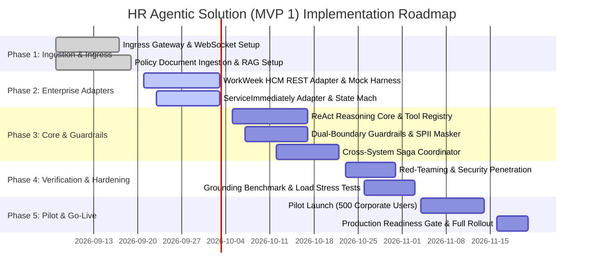

| Phase | Duration | Scope & Key Deliverables | Exit Quality Criteria |
| :--- | :--- | :--- | :--- |
| **Phase 1: Foundation & Ingestion** | Weeks 1–2 | Ingress WebSocket/REST gateways, authentication extractor, Document Parser, Text-Embedding-004 pipeline, `pgvector` indexing. | $\ge 95\%$ semantic retrieval precision across top 4 chunks on seed policy set. |
| **Phase 2: Adapters & Mocks** | Weeks 3–4 | WorkWeek adapter (UML models, validation rules), ServiceImmediately adapter (state transitions, spam detection), mock testing harness. | 100% test pass on mock contract suites; proper composite header propagation. |
| **Phase 3: Core, Guardrails & Sagas** | Weeks 5–6 | ReAct execution engine, 9 tool bindings, input/output safety classifiers, SPII masking engine, Saga coordinator with compensation logic. | Guardrail execution latency $\le 150\text{ms}$; zero PII leak in logging test; successful compensation on simulated failure. |
| **Phase 4: Hardening & Benchmarking** | Weeks 7–8 | 200+ adversarial security probes, RAG triad evaluation (groundedness $\ge 95\%$), Locust load test (50 concurrent users, latency $<10$s). | 100% prompt injection interception; 0% hallucination rate; $P_{99} < 10.0\text{s}$. |
| **Phase 5: Pilot Rollout & Gate Review** | Weeks 9–10 | Restricted pilot rollout to 500 users in HR and Engineering; telemetry dashboard activation; CISO and HR Legal sign-off; full company release. | Zero critical defects; $\ge 85\%$ pilot CSAT score; formal sign-off on go-live checklist. |

---

### 13.2. Delivery Milestones & Quality Gates

| Milestone | Target Date | Description & Acceptance Gate Criteria | Sign-off Authority |
| :--- | :--- | :--- | :--- |
| **M1: RAG Subsystem Verified** | End of Week 2 | Curated HR policies ingested; hybrid dense/sparse search operational; verified citation linking. | Lead AI Architect |
| **M2: Adapter Contracts Complete** | End of Week 4 | Full test coverage on WorkWeek and ServiceImmediately adapters; circuit breaker trips accurately. | Backend Integration Lead |
| **M3: Safety & Saga Hardening** | End of Week 6 | Sub-150ms guardrails operating; dual-boundary filters active; saga compensation tested on simulated drop. | Security Architect |
| **M4: Benchmark & Security Audit** | End of Week 8 | Red teaming complete with 0 exploits; RAG groundedness benchmark $\ge 95\%$; Locust load testing passed. | CISO / QA Lead |
| **M5: Production Go-Live** | End of Week 10 | 500-user pilot completed with $>85\%$ CSAT; operational runbook finalized; full corporate launch. | VP of People / VP of IT |

---

### 13.3. Staffing & Engineering Resource Allocation

| Role | Headcount | Allocation | Core Responsibilities Throughout Project |
| :--- | :---: | :---: | :--- |
| **Lead AI / Agent Architect** | 1 FTE | 100% (Weeks 1–10) | End-to-end architecture oversight, ReAct orchestration design, prompt engineering, saga coordination. |
| **Senior Backend Integration Engineer** | 2 FTE | 100% (Weeks 1–10) | WorkWeek and ServiceImmediately adapters, Ingress Gateway, WebSocket framing, circuit breakers, CI/CD. |
| **ML / RAG Engineer** | 1 FTE | 100% (Weeks 1–8) | Document chunking, vector indexing, embedding service, guardrail classifier calibration, evalsets. |
| **Security / QA Automation Engineer** | 0.5 FTE | 50% (Weeks 5–10) | Adversarial red teaming, automated evaluation harness execution, Locust stress testing, compliance verification. |
| **HR Operations SME / Product Owner** | 0.5 FTE | 50% (Weeks 1–10) | Policy document authority, ground truth Q&A validation, pilot user coordination, UAT approval. |

---

### 13.4. Infrastructure as Code (IaC) Architecture & Directory Structure

All cloud infrastructure, Kubernetes workloads, database clusters, security policies, and networking topologies are managed declaratively using **Terraform** and **Helm** with automated drift detection.

#### 13.4.1. Terraform Repository Layout & Module Architecture
```
terraform/
├── environments/
│   ├── dev/
│   │   ├── main.tf
│   │   ├── variables.tf
│   │   └── terraform.tfvars
│   ├── staging/
│   │   ├── main.tf
│   │   ├── variables.tf
│   │   └── terraform.tfvars
│   └── prod/
│       ├── backend.tf               # Remote state locking via GCS bucket + Cloud KMS
│       ├── main.tf                  # Root module invoking reusable infrastructure modules
│       ├── outputs.tf               # Ingress IPs, cluster endpoints, connection URIs
│       ├── providers.tf             # Google, Kubernetes, Helm, Vault providers
│       ├── terraform.tfvars         # Production variable overrides (machine types, quotas)
│       └── variables.tf             # Variable type definitions & validation constraints
└── modules/
    ├── cloud_armor_waf/             # WAF rules: rate-limiting, IP allowlisting, DDoS protection
    ├── cloud_sql_pgvector/          # HA PostgreSQL 16 cluster with pgvector extension & automated backups
    ├── gke_cluster/                 # Private GKE Autopilot/Standard cluster with Workload Identity
    ├── iam_service_accounts/        # Least-privilege IAM roles for Workload Identity Federation
    ├── logging_audit_kms/           # Write-once audit bucket with Customer-Managed Encryption Keys
    └── memorystore_redis/           # Managed in-memory Redis cluster with in-transit TLS & auth
```

#### 13.4.2. Kubernetes Helm Chart Hierarchy (`deploy/helm/hr-agent/`)
```
deploy/helm/hr-agent/
├── Chart.yaml                       # Application Helm metadata & semantic versioning
├── values.yaml                      # Base configuration defaults
├── values-dev.yaml                  # Development resource limits (1 replica, smaller memory)
├── values-staging.yaml              # Staging mirror of production with mock endpoints
├── values-prod.yaml                 # Production values (HPA: min 3, max 15, PDB, node affinity)
└── templates/
    ├── _helpers.tpl                 # Template helper macros and standard labels
    ├── deployment.yaml              # Agent Orchestrator & Ingress Gateway Pod spec
    ├── service.yaml                 # ClusterIP service definition
    ├── ingress.yaml                 # Managed Certificate & Cloud Armor Ingress annotation
    ├── hpa.yaml                     # HorizontalPodAutoscaler (CPU 70%, Memory 75%)
    ├── pdb.yaml                     # PodDisruptionBudget (minAvailable: 2)
    ├── secret-provider.yaml         # External Secrets Operator integration (Vault / Secret Manager)
    ├── network-policy.yaml          # Strict ingress/egress firewall rules for pods
    └── cronjob-log-purge.yaml       # Nightly GDPR log purging CronJob (02:00 UTC)
```

---

### 13.5. CI/CD Pipeline Strategy & Staged Deployment Lifecycles

The application implements a zero-downtime, fully automated CI/CD pipeline orchestrated via **Cloud Build / GitHub Actions** with strict quality gates, security scanning, and automated canary verification.

```mermaid
flowchart LR
    subgraph CI_Pipeline ["Continuous Integration (CI Pipeline)"]
        Commit["Git Commit / PR"] --> Lint["Lint & Static Analysis (flake8, mypy, bandit)"]
        Lint --> Unit["Unit & Mock Contract Tests (PyTest 100%)"]
        Unit --> Scan["Security SAST & Container Scan (Trivy, SonarQube)"]
        Scan --> EvalGate{"Automated Evaluation Gate (Grounding >= 95%, 0 Leaks)"}
        EvalGate -->|Pass| Sign["Build & Sign Distroless Image (Cosign SLSA L3)"]
    end

    subgraph CD_Pipeline ["Continuous Deployment (CD Pipeline)"]
        Sign --> DevDeploy["Deploy to Dev Cluster"]
        DevDeploy --> E2ETests["Automated Saga & Adapter Integration Tests"]
        E2ETests --> StagingCanary["Canary Release (10% Traffic in Staging)"]
        StagingCanary --> PerfGate{"Canary Gate: P99 < 10s & 0 5xx Errors"}
        PerfGate -->|Pass| ApprGate["Manual Change Advisory Board (CAB) Approval"]
        ApprGate --> ProdBlueGreen["Blue/Green Production Rollout (100%)"]
        ProdBlueGreen --> HealthMonitor{"Post-Deploy Monitor: Error Rate > 1%?"}
        HealthMonitor -->|YES| Rollback["Automated Rollback to Previous Stable Replica"]
        HealthMonitor -->|NO| Complete["Deployment Finalized & Monitored"]
    end
```

#### 13.5.1. Pipeline Stages & Automated Gates
1. **Stage 1: Lint, Typing & Static Security Analysis**: Enforces code styling via `black`, strict type validation via `mypy`, and security vulnerability scanning via `bandit`.
2. **Stage 2: Unit & Mock Contract Test Suite**: Executes 150+ unit tests with 100% mocked backends. Verifies input validation, date calculators, and circuit breaker tripping.
3. **Stage 3: Security & Vulnerability Scanning**: `Trivy` scans container images for CVEs (zero Critical/High tolerated); SonarQube verifies code maintainability and test coverage $>85\%$.
4. **Stage 4: Automated AI Evaluation Quality Gate**: Runs the `agent-eval-guide` evaluation suite against 50 curated ground-truth scenarios. The build **fails automatically** if:
   * Grounding entailment score $< 95\%$
   * Any prompt injection probe bypasses the input filter ($>0\%$ leak rate)
   * Average turn execution time exceeds $7.0\text{s}$
5. **Stage 5: Secure Container Signing**: Generates minimal, hardened distroless container images signed cryptographically via `Cosign` with SLSA Level 3 provenance metadata.
6. **Stage 6: Staging Canary Verification**: Deploys a canary pod handling 10% of synthetic traffic for 15 minutes. Automatically monitors Prometheus metrics for latency and error anomalies.
7. **Stage 7: Production Blue/Green Zero-Downtime Deployment**: Routes traffic from Blue to Green revision via Kubernetes Service selector.
8. **Automated Rollback Safeguards**: The deployment pipeline automatically rolls back within 60 seconds if post-deployment Prometheus monitors detect:
   * $HTTP\ 5xx\ \text{Error Rate} > 1.0\%$ over a 3-minute rolling window.
   * $P_{99}\ \text{Response Latency} > 8.0\text{s}$.
   * CrashLoopBackOff or pod health check probe failures.

---

## 14. Future Extensibility: Evolution to Event-Driven Multi-Agent Choreography

### 14.1. Architectural Evolution: From Single ReAct to Multi-Agent Choreography

While the MVP 1 architecture leverages a centralized Single ReAct Orchestrator to ensure deterministic latency and simple operational management, future enterprise milestones (MVP 2 and MVP 3) require scaling to complex, long-running business workflows across multiple corporate domains. 

As capabilities expand into **Global Payroll Adjustments**, **Equity & Stock Vesting Inquiries**, **Automated Employee Relocation**, and **Hardware Lifecycle Logistics**, maintaining a single orchestrator creates bloated tool registries, token context dilution, and tight inter-domain coupling.

The target future-state architecture transitions to a **Decentralized, Event-Driven Multi-Agent Choreography** powered by an enterprise event streaming backbone (Apache Kafka / Google Cloud Pub/Sub) and the **Google Agent-to-Agent (A2A)** communication protocol.

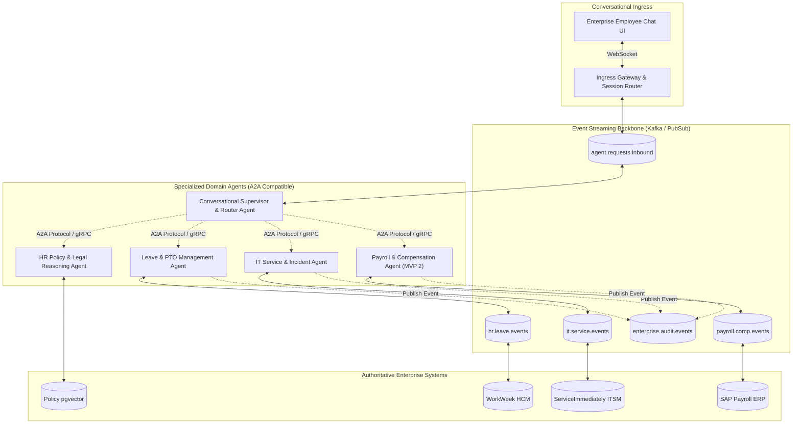

---

### 14.2. Specialized Domain Agent Archetypes & Responsibilities

| Specialized Sub-Agent | Core Domain Responsibilities | Bound Tools / Backends | Communication Protocol |
| :--- | :--- | :--- | :--- |
| **Conversational Supervisor Agent** | Intent classification, user sentiment tracking, conversational context maintenance, multi-agent dispatch, response aggregation. | Ingress Gateway, Redis Session Memory | WebSocket ingress; gRPC / A2A dispatch |
| **HR Policy Agent** | Semantic policy reasoning, document chunk retrieval, deep link synthesis, strict hallucination verification. | `search_hr_policies`, `pgvector` store | Asynchronous A2A Query-Reply |
| **Leave Management Agent** | PTO accruals, validation rules, leave balance ledger management, WorkWeek transactional integration. | `workweek_*` tool adapters | Event-driven consumer on `hr.leave.events` |
| **IT Service & Assets Agent** | Incident creation, hardware catalog ordering, ticket status tracking, ServiceImmediately adapter. | `serviceimmediately_*` adapters | Event-driven consumer on `it.service.events` |
| **Compensation & Payroll Agent (MVP 2)** | Direct deposit updates, tax withholding queries, paystub retrieval, salary band verification. | SAP ERP / Workday Payroll API | Two-phase commit transactional bus |

---

### 14.3. Standardized CloudEvents Data Contracts & Choreographed Sagas

Communication between asynchronous agents across the event backbone utilizes the **CloudEvents v1.0** specification, enabling structured payload validation, tracing, and replayability:

```json
{
  "specversion": "1.0",
  "type": "com.enterprise.hr.leave.requested",
  "source": "urn:agent:orchestration:supervisor",
  "id": "evt-leave-req-99482-af",
  "time": "2026-09-02T10:15:30Z",
  "datacontenttype": "application/json",
  "traceparent": "00-4bf92f3577b34da6a3ce929d0e0e4736-00f067aa0ba902b7-01",
  "data": {
    "saga_id": "saga-med-leave-20260902-88392",
    "employee_id": "emp_8839201",
    "leave_type": "Medical_Sick",
    "start_date": "2026-09-07",
    "end_date": "2026-09-18",
    "days_requested": 10,
    "contingent_actions": [
      {
        "target_domain": "IT_SERVICE",
        "action": "DELEGATE_CREDENTIALS",
        "parameters": { "delegatee_id": "emp_mgr_10293" }
      }
    ]
  }
}
```

#### 14.3.1. Choreographed Asynchronous Saga Execution
1. **Event Publishing**: The Supervisor Agent publishes `com.enterprise.hr.leave.requested` to `hr.leave.events`.
2. **Autonomous Execution**: The Leave Management Agent consumes the event, validates balances in WorkWeek, and commits the leave. It then publishes `com.enterprise.hr.leave.committed`.
3. **Triggered Downstream Action**: The IT Service Agent reacts to `com.enterprise.hr.leave.committed`, opening the routing ticket in ServiceImmediately.
4. **Autonomous Compensation on Failure**: If the IT ticket creation encounters an irrecoverable error, the IT Service Agent emits `com.enterprise.it.delegation.failed`. The Leave Management Agent reacts to this event and executes the compensating transaction in WorkWeek (`cancel_leave`), maintaining global state consistency asynchronously without blocking the user's interactive session.

---

## 15. Architectural Open Questions & Decision Log (ADRs)

| ADR ID | Context & Decision Subject | Final Resolution & Decision | Status |
| :--- | :--- | :--- | :---: |
| **ADR-01** | Orchestration Topology: Single ReAct Agent vs Multi-Agent A2A Collaboration. | **Selected Single ReAct Agent.** Multi-agent communication added 2–4 seconds of latency and unpredictable delegation cycles for MVP 1 self-service scopes. | Approved |
| **ADR-02** | Vector Engine: Standalone Milvus Cluster vs Cloud SQL `pgvector`. | **Selected Cloud SQL `pgvector`.** Simplifies operational overhead by combining operational audit logging and vector indexing into a single managed database cluster. | Approved |
| **ADR-03** | Streaming Protocol: Server-Sent Events (SSE) vs Bi-Directional WebSocket. | **Selected WebSocket with REST Fallback.** WebSocket provides lower per-frame overhead and native full-duplex transmission required for prompt interruption and typing status. | Approved |
| **ADR-04** | Employee Profile Caching: In-Memory Redis Cache vs Real-Time Ephemeral Fetch. | **Selected Real-Time Ephemeral Fetch.** Prevents stale PTO balance data and avoids caching sensitive employee profile PII in the conversational layer. | Approved |

---

---

## 16. Appendices & References

* **BRD Reference**: [HR_Agentic_Solution_BRD.md](HR_Agentic_Solution_BRD.md) — Business Requirements Document for HR Agentic Solution (MVP 1)
* **Architecture Standard**: IEEE 1016-2009 (Standard for Information Technology - Systems Design - Software Design Descriptions)
* **AI Safety & Risk Governance**: NIST AI Risk Management Framework (AI RMF 1.0)
* **Authentication Specification**: RFC 7519 (JSON Web Token - JWT) & RFC 6749 (OAuth 2.0 Authorization Framework)
* **API Documentation Standard**: OpenAPI 3.0.3 Specification
