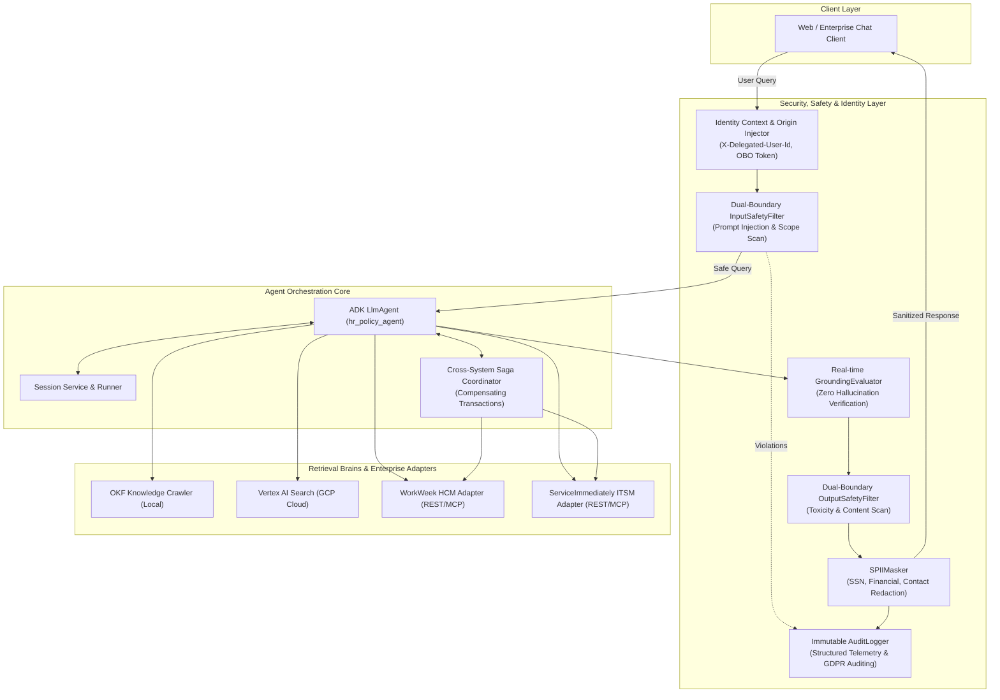

# HR Agentic Solution (MVP 1)

[](#architecture--component-topology)
[](#testing--verification)
[](https://www.python.org/)
[](https://github.com/google/adk)

An enterprise-grade, conversational AI solution designed to automate Tier 1 Human Resources (HR) and Information Technology (IT) inquiries, streamline self-service transactional workflows, and coordinate multi-step cross-system sagas.

Built strictly in conformance with the **[Software Design Document (SDD)](HR_Agentic_Solution_SDD.md)** and Google ADK.

---

## Architecture & Component Topology



---

## Architectural Pillars

### 1. Dual-Boundary Safety & SPII Redaction (`agent/security/guardrails.py`)
- **`InputSafetyFilter`**: Fast-path ($<150\text{ms}$) scanner filtering prompt injections (`IGNORE PREVIOUS INSTRUCTIONS`, `DAN Mode`, system overrides) and out-of-scope adversarial prompts.
- **`OutputSafetyFilter`**: Scans LLM candidates for toxic or destructive content.
- **`SPIIMasker`**: Deterministic redaction engine replacing sensitive entities with standardized tokens:
  - Social Security Numbers $\rightarrow$ `[REDACTED_SSN]`
  - Credit Cards / Bank Details $\rightarrow$ `[REDACTED_FINANCIAL]`
  - National Government IDs $\rightarrow$ `[REDACTED_GOV_ID]`
  - Personal Phones & Contact Details $\rightarrow$ `[REDACTED_CONTACT]`

### 2. Delegated Identity & OBO Propagation (`agent/security/identity.py`)
- **`IdentityContextInjector`**: Injects standard composite headers into all downstream SaaS calls:
  - `X-Delegated-User-Id`: Caller's verified employee identifier.
  - `X-Automation-Origin`: System identifier (`HR-Agentic-Solution-MVP1`).
  - `X-Execution-Id`: Unique cryptographic turn execution identifier.
  - `Authorization`: On-Behalf-Of (OBO) bearer token.
- **Revocation Blacklist**: Instant sub-second session severance for offboarded employees.

### 3. Enterprise Integration Adapters (`agent/adapters/`)
- **`WorkWeekAdapter`** (`agent/adapters/workweek_adapter.py`):
  - Manages employee profiles, contact updates, and leave balances.
  - Enforces business rules: dates cannot be in the past, end dates must follow start dates, requested days cannot exceed available balance, and phone numbers must follow E.164.
- **`ServiceImmediatelyAdapter`** (`agent/adapters/serviceimmediately_adapter.py`):
  - Enforces strict incident state machine transitions:
    $$\text{New} \longrightarrow \text{In\_Progress} \longrightarrow \text{Resolved} \longrightarrow \text{Closed}$$
  - Direct $\text{New} \longrightarrow \text{Closed}$ transitions are blocked.
  - Mandatory resolution notes required when transitioning to `Resolved` or `Closed`.

### 4. Cross-System Compensating Sagas (`agent/orchestration/saga_coordinator.py`)
- **`SagaCoordinator`**: Coordinates multi-system distributed operations:
  - **Medical Leave (UC-2.2)**: Submits sick leave in WorkWeek and creates IT workflow delegation incident in ServiceImmediately. If the ticketing system fails, executes compensation and generates an HR Ops manual follow-up task.
  - **Equipment Procurement (UC-2.1)**: Verifies employee profile and shipping address in WorkWeek, then creates hardware procurement incident in ServiceImmediately.
  - **Relocation (UC-2.3)**: Updates WorkWeek contact details and triggers facility badge update.

### 5. Grounding & Zero Hallucination (`agent/security/grounding.py`)
- **`GroundingEvaluator`**: Dynamically scores entailment between model responses and retrieved knowledge chunks. Answers lacking contextual support are flagged before delivery.

### 6. Immutable Audit Telemetry (`agent/security/audit.py`)
- **`AuditLogger`**: Structured JSON logging capturing event IDs, session IDs, masked payloads, execution latencies, and security evaluations compliant with GDPR Article 17.

---

## Directory Structure

```
.
├── agent/
│   ├── adapters/                  # Enterprise intermediate SaaS adapters (SDD Section 6)
│   │   ├── serviceimmediately_adapter.py
│   │   └── workweek_adapter.py
│   ├── orchestration/             # Cross-system Saga Coordinator (SDD Section 7)
│   │   └── saga_coordinator.py
│   ├── security/                  # Safety, Identity, Grounding & Audit (SDD Section 4 & 9)
│   │   ├── audit.py
│   │   ├── grounding.py
│   │   ├── guardrails.py
│   │   └── identity.py
│   ├── tools/                     # Tool callables for ADK ReAct loop
│   │   ├── mcp_tool.py            # ADK McpToolset (Streamable HTTP)
│   │   ├── okf_tool.py            # Local OKF knowledge crawler
│   │   └── rag_tool.py            # Vertex AI Search RAG engine
│   ├── agent.py                   # Core ADK LlmAgent entry point & runner
│   ├── config.py                  # Environment and model configuration
│   ├── prompt.py                  # Grounded system instructions
│   └── server.py                  # Production REST API & /healthz probe server
├── evals/                         # 4-Tier Golden dataset evaluation harness
│   ├── golden/
│   │   ├── eval_config.json
│   │   └── golden_agent_eval.evalset.json
│   └── run_eval.py
├── knowledge/                     # Open Knowledge Format (OKF) markdown bundle
├── tests/                         # Automated PyTest unit and integration tests
│   ├── test_adapters.py
│   ├── test_grounding.py
│   ├── test_identity_audit.py
│   ├── test_okf_rag.py
│   ├── test_safety.py
│   ├── test_sagas.py
│   ├── test_server.py
│   └── mcp_client_check.py
├── Dockerfile                     # Hardened container definition
├── Makefile                       # Automation targets (test, lint, eval, run, serve)
├── pyproject.toml                 # Dependencies and tool configurations
└── README.md
```

---

## Getting Started

### Prerequisites
- Python 3.11 or higher
- `uv` package manager (recommended) or standard `pip`

### 1. Environment Setup
Clone the repository and copy the environment template:
```bash
cp .env.example .env
```
Edit `.env` with your Google Cloud and MCP settings:
```dotenv
GOOGLE_GENAI_USE_VERTEXAI=true
GOOGLE_CLOUD_PROJECT=your-project-id
GOOGLE_CLOUD_LOCATION=global
GEMINI_MODEL=gemini-3.5-flash
RETRIEVAL_MODE=okf

# Enterprise Systems MCP Integration
MCP_SERVER_URL=https://mock-saas.aishprabhat.demo.altostrat.com
MCP_SERVER_TOKEN=your_mcp_token_here
DEFAULT_EMPLOYEE_ID=EMP-1042
```

### 2. Install Dependencies
```bash
uv venv
source .venv/bin/activate
uv pip install -e ".[lint,test]"
```

### 3. Run Automated Tests
```bash
make test
# or directly:
pytest tests/ -v
```

### 4. Interactive Agent CLI
```bash
make run
# or directly:
python -m agent.agent --interactive
```

### 5. Production HTTP Server & Healthcheck Probe
```bash
make serve
# or directly:
python -m agent.server
```
- Health Probe: `GET /healthz` $\rightarrow$ `{"status": "healthy", "service": "hr_policy_agent", "version": "1.0.0"}`
- Service Info: `GET /` $\rightarrow$ Service metadata
- Ingress Chat API: `POST /api/v1/chat` $\rightarrow$ `{"query": "...", "user_id": "EMP-1042"}`

### 6. Run Golden Evaluation Dataset
```bash
make eval
```

---

## Container Deployment (Docker)

Build and run the hardened, non-root production container:
```bash
make docker-build
docker run -p 8080:8080 --env-file .env hr-policy-agent:latest
```

The container automatically starts the HTTP server on port `8080` (or `$PORT`) and responds to Docker / Cloud Run healthcheck probes (`curl -f http://localhost:8080/healthz`).

---

## License & Compliance
Compliant with Enterprise Information Security, Zero-Trust AI governance, and GDPR Article 17 Data Protection standards.
